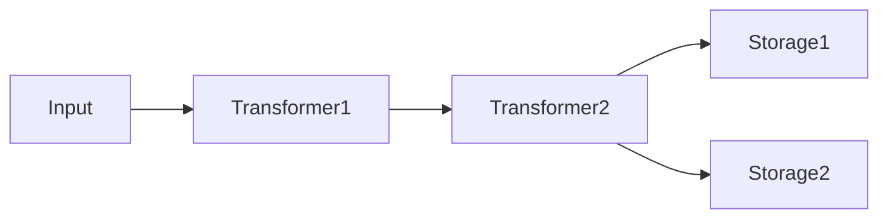
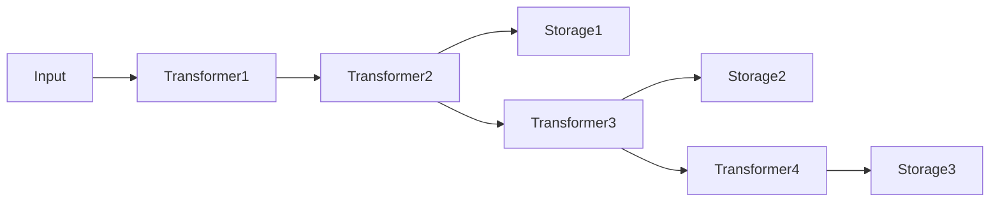

# unikvs

TypeScript で実装されたモジュラーでポータブルな KVS クライアントです。プラグインによる透過的なデータ変換と複数のバックエンドストレージへの書き込みをサポートします。

## インストール

```sh
pnpm add unikvs
```

## 基本的な使い方

```typescript
import { Compression } from "@unikvs/compression";
import { NodeFs } from "@unikvs/fs.node";
import { UniKvs, type Value } from "unikvs";

const kvs = UniKvs.config<{
  // キー "foo" に対して、バイト配列を単体またはストリーム形式で保存できることを型定義します。
  foo: Value<Uint8Array<ArrayBuffer>>;
}>()
  // バイト配列を透過的に gzip 圧縮/展開するトランスフォーマープラグインを追加します。
  .appendTransformer(new Compression("gzip"))
  // バイト配列を ".tmp/" 配下に保存するストレージプラグインを追加します。
  .appendStorage(new NodeFs(".tmp"))
  // KVS クライントを作成します。
  .create();

// クライアントを開きます。
await kvs.open();

// キー "foo" に単一のバイト配列を保存します。
await kvs.set("foo", Uint8Array.from([0, 1, 2]));

// キー "foo" から単一のバイト配列を取得します。
const bytes = await kvs.get("foo");

// クライアントを閉じます。
await kvs.close();
```

## アーキテクチャー

unikvs はビルダーパターンで構成されます。



1. **トランスフォーマー (Transformer)** — データのエンコード・デコードを透過的に行います。
2. **ストレージ (Storage)** — データの永続化先です。複数のストレージを指定すると、すべてのストレージに並列で書き込まれます。

各ストレージは、登録時点までに追加されたトランスフォーマーを前段パイプラインとして使います。
そのためトランスフォーマーとストレージを交互に追加すると、ストレージごとに異なるパイプラインを構成できます。

```typescript
const kvs = UniKvs.config()
  .appendTransformer(new Transformer1())
  .appendTransformer(new Transformer2())
  .appendStorage(new Storage1())
  .appendTransformer(new Transformer3())
  .appendStorage(new Storage2())
  .appendTransformer(new Transformer4())
  .appendStorage(new Storage3())
  .create();
```



読み取り時は、キーが見つかったストレージの前段パイプラインを逆順に適用してデコードします。

### 設定ビルダー

`UniKvs.config()` でビルダーを作成し、以下の順序で設定します。

1. `setVariables(vars)` — 実行時変数を設定します（省略可能）。
2. `appendTransformer(transformer)` — トランスフォーマーを追加します（省略可能、ストレージの登録後にも追加可能）。
3. `appendStorage(storage)` — ストレージを追加します（必須、複数追加可能）。
4. `create()` — KVS クライアントを作成します。

### クライアント

作成したクライアントは以下の操作を提供します。

| メソッド          | 説明                                                     |
| ----------------- | -------------------------------------------------------- |
| `open()`          | ストレージとトランスフォーマーを初期化します。           |
| `close()`         | すべてのストレージとトランスフォーマーをクローズします。 |
| `set(key, value)` | キーに値を保存します。                                   |
| `get(key)`        | キーから値を取得します。                                 |
| `stream(key)`     | キーからストリームを取得します。                         |
| `has(key)`        | キーが存在するかを確認します。                           |
| `delete(key)`     | キーを削除します。                                       |
| `clear()`         | すべてのデータを削除します。                             |

すべての操作は `AbortSignal` によるキャンセルと、実行時変数の受け渡しをサポートします。

```typescript
const ac = new AbortController();
setTimeout(() => ac.abort(), 1000);

await kvs.set("key", value, { signal: ac.signal });
```

## プラグイン

### トランスフォーマー

| パッケージ            | 説明                                                                           |
| --------------------- | ------------------------------------------------------------------------------ |
| `@unikvs/compression` | gzip / deflate / deflate-raw による透過的な圧縮・展開を行います。              |
| `@unikvs/checksum`    | MD5 / SHA-1 / SHA-224 / SHA-256 / SHA-384 / SHA-512 のハッシュ値を検証します。 |

### ストレージ

| パッケージ          | 説明                                          | 環境       |
| ------------------- | --------------------------------------------- | ---------- |
| `@unikvs/fs.node`   | ローカルファイルシステムに保存します。        | Node.js    |
| `@unikvs/s3.node`   | S3 互換のオブジェクトストレージに保存します。 | Node.js    |
| `@unikvs/memory`    | メモリー上に保存します。                      | すべて     |
| `@unikvs/indexeddb` | ブラウザーの IndexedDB に保存します。         | ブラウザー |
| `@unikvs/opfs`      | ブラウザーの OPFS に保存します。              | ブラウザー |

## 型定義

### Value, PlainValue, StreamValue の役割

`Value`, `PlainValue`, `StreamValue` は実行時には存在しない型レベルのブランドです。これらを使ってキーと値のマッピングを定義すると、キーごとに利用可能なメソッドが型によって制御されます。

| 型               | 書き込み                           | 読み取り      | ストリーム読み取り            |
| ---------------- | ---------------------------------- | ------------- | ----------------------------- |
| `PlainValue<T>`  | `set(key, T)`                      | `get(key): T` | 不可                          |
| `StreamValue<T>` | `set(key, T \| ReadableStream<T>)` | 不可          | `stream(key): ValueStream<T>` |
| `Value<T>`       | `set(key, T \| ReadableStream<T>)` | `get(key): T` | `stream(key): ValueStream<T>` |

#### `PlainValue`

単一の値として保存・取得するキーに使います。`set()` には値そのものを渡し、`get()` で値を取得します。

```typescript
import { UniKvs, type PlainValue } from "unikvs";

const kvs = UniKvs.config<{
  message: PlainValue<string>;
  avatar: PlainValue<Uint8Array>;
  count: PlainValue<number>;
}>()
  .appendStorage(new Memory())
  .create();

await kvs.open();

await kvs.set("message", "hello");
const msg = await kvs.get("message");
// msg は string 型

await kvs.set("avatar", new Uint8Array([0x89, 0x50, 0x4e, 0x47]));
const img = await kvs.get("avatar");
// img は Uint8Array 型
```

`PlainValue<T>` のキーに対して `stream()` を呼ぼうとすると、型エラーになります。

```typescript
// ❌ 型エラー: Argument of type '"message"' is not assignable to parameter of type...
kvs.stream("message");
```

#### `StreamValue`

ストリームとして読み取るキーに使います。大規模なデータや、逐次処理が必要なデータに適しています。`set()` には値そのものか `ReadableStream` を渡せます。`get()` は利用できず、代わりに `stream()` で `ValueStream`（ReadableStream のラッパー）を取得します。

```typescript
import { UniKvs, type StreamValue } from "unikvs";

const kvs = UniKvs.config<{
  logs: StreamValue<Uint8Array>;
}>()
  .appendStorage(new Memory())
  .create();

await kvs.open();

// ReadableStream での書き込み
const stream = new ReadableStream({
  start(controller) {
    controller.enqueue(new Uint8Array([0x01]));
    controller.enqueue(new Uint8Array([0x02]));
    controller.close();
  },
});
await kvs.set("logs", stream);

// ストリームとして読み取り
const reader = (await kvs.stream("logs")).getReader();
while (true) {
  const { done, value } = await reader.read();
  if (done) break;
  console.log(value); // Uint8Array
}
```

`StreamValue<T>` のキーに対して `get()` を呼ぼうとすると、型エラーになります。

```typescript
// ❌ 型エラー
kvs.get("logs");
```

#### `Value`

`PlainValue<T> | StreamValue<T>` の糖衣構文です。同じキーに対して単一値での読み書きとストリーム読み取りの両方をサポートしたい場合に使います。

```typescript
import { UniKvs, type Value } from "unikvs";

const kvs = UniKvs.config<{
  data: Value<Uint8Array>;
}>()
  .appendStorage(new Memory())
  .create();

await kvs.open();

// 単一値での保存・取得
await kvs.set("data", new Uint8Array([1, 2, 3]));
const all = await kvs.get("data");
// all は Uint8Array 型

// ストリームでの保存・読み取り
const src = new ReadableStream({ ... });
await kvs.set("data", src);
const reader = (await kvs.stream("data")).getReader();
```

## エラー

すべてのエラーは説明・原因・解決方法を含むメッセージを提供します。エラーは `ErrorBase` を継承しており、i18n 対応しています。

## ライセンス

[MIT](LICENSE)
