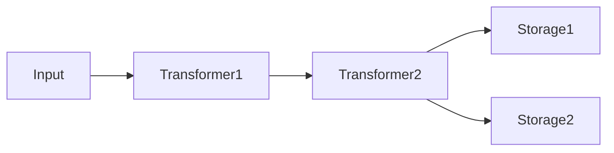
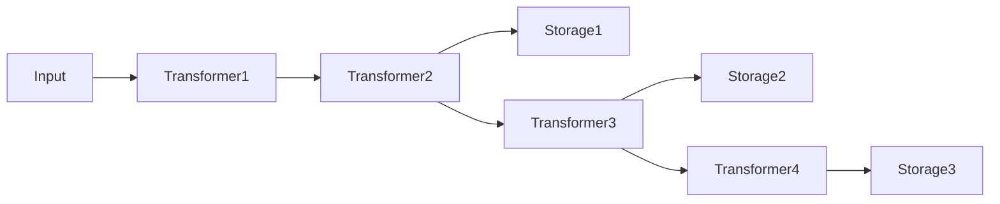

## Architecture [#architecture]

unikvs is built on the builder pattern. Input passes through a chain of Transformers and reaches Storages.



There are two roles:

- Transformers transparently encode and decode data.
- Storages are persistence destinations. When multiple Storages are specified, writes go to all of them in parallel.

Each Storage uses the Transformers added up to the point of its registration as its upstream pipeline. So alternating Transformers and Storages lets you build a different pipeline per Storage.

```ts
const kvs = UniKvs.config()
  .appendTransformer(new Transformer1())
  .appendTransformer(new Transformer2())
  .appendStorage(new Storage1())
  .appendTransformer(new Transformer3())
  .appendStorage(new Storage2())
  .appendTransformer(new Transformer4())
  .appendStorage(new Storage3())
  .create();
```



On reads, the upstream pipeline of the Storage where the key was found is applied in reverse to decode the data.

:::note
Writes go to all Storages in parallel, while reads search in registration order and decode and return the first key found. Registering a fast storage backend first speeds up reads.
:::

## Config builder [#config-builder]

Create a builder with `UniKvs.config()` and configure it in the following order:

<Steps>
  <Step title="setVariables(vars)">
    Sets runtime variables. Optional.
  </Step>
  <Step title="appendTransformer(transformer)">
    Adds a Transformer. Optional, and can also be added after registering Storages.
  </Step>
  <Step title="appendStorage(storage)">
    Adds a Storage. Required, and can be added multiple times.
  </Step>
  <Step title="create()">
    Creates the KVS client.
  </Step>
</Steps>

## Client operations [#client-operations]

| Method | Description |
| --- | --- |
| `open()` | Initializes Storages and Transformers. |
| `close()` | Closes all Storages and Transformers. |
| `set(key, value)` | Saves a Value under a key. |
| `get(key)` | Gets the Value for a key. |
| `stream(key)` | Gets a stream for a key. |
| `has(key)` | Checks whether a key exists. |
| `delete(key)` | Deletes a key. |
| `clear()` | Deletes all data. |

All operations support cancellation via `AbortSignal` and passing of runtime variables.

```ts
const ac = new AbortController();
setTimeout(() => ac.abort(), 1000);

await kvs.set("key", value, { signal: ac.signal });
```

## Value types [#value-types]

`Value`, `PlainValue`, and `StreamValue` are type-level markers that don't exist at runtime. Defining a key-to-Value mapping controls the available methods per key at the type level.

| Type | Write | Read | Stream read |
| --- | --- | --- | --- |
| `PlainValue<T>` | `set(key, T)` | `get(key): T` | Not available |
| `StreamValue<T>` | `set(key, T \| ReadableStream<T>)` | Not available | `stream(key): ValueStream<T>` |
| `Value<T>` | `set(key, T \| ReadableStream<T>)` | `get(key): T` | `stream(key): ValueStream<T>` |

<Tabs>
  <Tab title="PlainValue">
    Use for storing and getting a single Value. `stream()` is a type error.

    ```ts
    import { UniKvs, type PlainValue } from "unikvs";

    const kvs = UniKvs.config<{
      message: PlainValue<string>;
    }>()
      .appendStorage(storage)
      .create();

    await kvs.set("message", "hello");
    const msg = await kvs.get("message");
    ```
  </Tab>
  <Tab title="StreamValue">
    Use for sequential processing of large data. `get()` is a type error.

    ```ts
    import { UniKvs, type StreamValue } from "unikvs";

    const kvs = UniKvs.config<{
      logs: StreamValue<Uint8Array>;
    }>()
      .appendStorage(storage)
      .create();

    await kvs.set("logs", new Uint8Array([0x01]));
    const valueStream = await kvs.stream("logs");
    ```
  </Tab>
  <Tab title="Value">
    Syntactic sugar for supporting both, equivalent to `PlainValue<T> | StreamValue<T>`.

    ```ts
    import { UniKvs, type Value } from "unikvs";

    const kvs = UniKvs.config<{
      blob: Value<Uint8Array>;
    }>()
      .appendStorage(storage)
      .create();

    await kvs.set("blob", new Uint8Array([1, 2, 3]));
    const all = await kvs.get("blob");
    const valueStream = await kvs.stream("blob");
    ```
  </Tab>
</Tabs>

## Runtime variables [#variables]

Variables are a runtime context for switching operation behavior. Set initial values with the builder's `setVariables()`, and override them per operation with `vars`.

```ts
const kvs = UniKvs.config<{ foo: Value<Uint8Array> }>()
  .setVariables({ region: "ap-northeast-1" })
  .appendStorage(storage)
  .create();

await kvs.set("foo", new Uint8Array([1]), {
  vars: { region: "us-east-1" },
});
```

<Expandable title="Automatically assigned variables">
The operation kind and target key are automatically assigned as `unikvs:action` and `unikvs:key`. Some Transformers use variables, such as specifying a hash for checksums. See each package reference for details.
</Expandable>

## Plugin kinds [#plugin-kinds]

| Kind | Package | Description |
| --- | --- | --- |
| Transformer | `@unikvs/compression` | Compresses and decompresses with gzip, deflate, and deflate-raw. |
| Transformer | `@unikvs/checksum` | Validates MD5, SHA-1, SHA-224, SHA-256, SHA-384, and SHA-512. |
| Storage | `@unikvs/memory` | Stores in memory. Works in all environments. |
| Storage | `@unikvs/fs.node` | Stores in the local filesystem. Node.js only. |
| Storage | `@unikvs/s3.node` | Stores in S3-compatible object storage. Node.js only. |
| Storage | `@unikvs/indexeddb` | Stores in the browser IndexedDB. |
| Storage | `@unikvs/opfs` | Stores in the browser OPFS. |

:::tip
To write your own plugin, see the custom plugin guide. Start from the `IStorage` implementation for a Storage, or the `ITransformer` implementation for a Transformer.
:::
