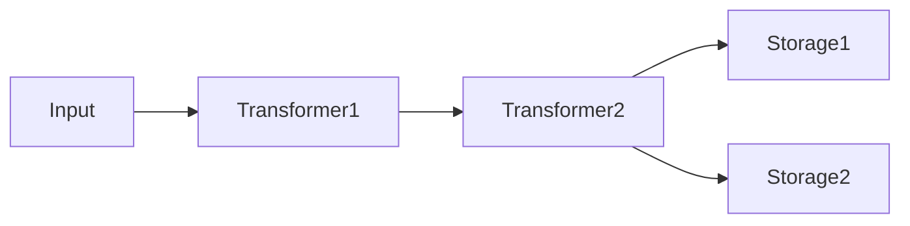
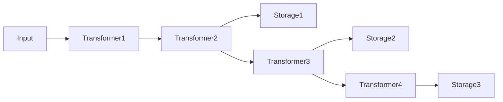

## Architecture [#architecture]

unikvs uses the builder pattern. Input passes through Transformers to Storages.



There are two roles:

- Transformers transparently encode/decode data.
- Storages are persistence destinations. With multiple Storages, writes go to all of them in parallel.

Each Storage uses the Transformers added up to its registration as its upstream pipeline. Alternating them builds a different pipeline per Storage.

```ts
const kvs = UniKvs.config()
  .appendTransformer(new Transformer1())
  .appendTransformer(new Transformer2())
  .appendStorage(new Storage1())
  .appendTransformer(new Transformer3())
  .appendStorage(new Storage2())
  .appendTransformer(new Transformer4())
  .appendStorage(new Storage3())
  .create();
```



On reads, the upstream pipeline of the found Storage is applied in reverse to decode the data.

:::note
Writes go to all Storages in parallel, while reads search in registration order and return the first key found. Register a fast backend first to speed up reads.
:::

## Config builder [#config-builder]

Create a builder with `UniKvs.config()` in the following order. Passing `schema` enables input and output validation with Valibot schemas, and also infers the key-to-value mapping type automatically.

```ts
import { PlainValue, StreamValue, UniKvs } from "unikvs";
import * as v from "valibot";

const kvs = UniKvs.config({
  schema: {
    message: PlainValue(v.string()),
    logs: StreamValue(v.instance(Uint8Array)),
  },
})
  .appendStorage(storage)
  .create();
```

Install `valibot` separately when using Valibot schemas. Omitting `schema` falls back to specifying the mapping with a type parameter, as before. In that case only type checking applies, with no runtime validation.

<Steps>
  <Step title="setVariables(vars)">
    Sets runtime variables (optional).
  </Step>
  <Step title="appendTransformer(transformer)">
    Adds a Transformer (optional). Can be added after registering Storages.
  </Step>
  <Step title="appendStorage(storage)">
    Adds a Storage (required, multiple allowed).
  </Step>
  <Step title="create()">
    Creates the KVS client.
  </Step>
</Steps>

## Client operations [#client-operations]

| Method | Description |
| --- | --- |
| `open()` | Initializes Storages and Transformers. |
| `close()` | Closes all Storages and Transformers. |
| `set(key, value)` | Saves a Value under a key. |
| `get(key)` | Gets the Value for a key. |
| `stream(key)` | Gets a stream for a key. |
| `has(key)` | Checks whether a key exists. |
| `delete(key)` | Deletes a key. |
| `clear()` | Deletes all data. |

All operations support cancellation via `AbortSignal` and passing of runtime variables.

## Value types [#value-types]

`Value`, `PlainValue`, and `StreamValue` are both types and functions. Used as types, they decide the available methods per key at the type level; used as functions, they infer types from Valibot schemas and validate values at runtime.

| Type | Write | Read | Stream read |
| --- | --- | --- | --- |
| `PlainValue<T>` | `set(key, T)` | `get(key): T` | Not available. |
| `StreamValue<T>` | `set(key, T \| ReadableStream<T>)` | Not available. | `stream(key): ValueStream<T>` |
| `Value<T>` | `set(key, T \| ReadableStream<T>)` | `get(key): T` | `stream(key): ValueStream<T>` |

`Value<T>` is sugar for both, equivalent to `PlainValue<T> | StreamValue<T>`. For schemas whose input and output types differ, such as `v.transform()`, the second type parameter becomes the `set` input type (`PlainValue<TData, TInput>`).

<Tabs>
  <Tab title="PlainValue">
    Use for storing and getting a single value. `stream()` is a type error.

    ```ts
    import { UniKvs, type PlainValue } from "unikvs";

    const kvs = UniKvs.config<{
      message: PlainValue<string>;
    }>()
      .appendStorage(storage)
      .create();

    await kvs.set("message", "hello");
    const msg = await kvs.get("message");
    ```
  </Tab>
  <Tab title="StreamValue">
    Use for sequential processing of large data. `get()` is a type error.

    ```ts
    import { UniKvs, type StreamValue } from "unikvs";

    const kvs = UniKvs.config<{
      logs: StreamValue<Uint8Array>;
    }>()
      .appendStorage(storage)
      .create();

    await kvs.set("logs", new Uint8Array([0x01]));
    const valueStream = await kvs.stream("logs");
    ```
  </Tab>
  <Tab title="Value">
    Sugar syntax for both, equivalent to `PlainValue<T> | StreamValue<T>`.

    ```ts
    import { UniKvs, type Value } from "unikvs";

    const kvs = UniKvs.config<{
      blob: Value<Uint8Array>;
    }>()
      .appendStorage(storage)
      .create();

    await kvs.set("blob", new Uint8Array([1, 2, 3]));
    const all = await kvs.get("blob");
    const valueStream = await kvs.stream("blob");
    ```
  </Tab>
</Tabs>

### Schema definition [#schema-definition]

Passing schemas to `UniKvs.config({ schema })` infers the mapping type from Valibot schemas and validates input and output values at runtime.

<Tabs>
  <Tab title="Object form">
    Keys are used as-is. Use for fixed keys.

    ```ts
    import { PlainValue, StreamValue, UniKvs } from "unikvs";
    import * as v from "valibot";

    const kvs = UniKvs.config({
      schema: {
        message: PlainValue(v.pipe(v.string(), v.minLength(1))),
        logs: StreamValue(v.instance(Uint8Array)),
      },
    })
      .appendStorage(storage)
      .create();

    await kvs.set("message", "hello");
    const msg = await kvs.get("message");
    // msg is typed as string
    ```
  </Tab>
  <Tab title="Array form">
    List pairs of key and value schemas. Use for dynamic keys. The first matching definition wins.

    ```ts
    import { PlainValue, StreamValue, UniKvs } from "unikvs";
    import * as v from "valibot";

    const kvs = UniKvs.config({
      schema: [
        [v.pipe(v.string(), v.regex(/^msg-.+/)), PlainValue(v.string())],
        [v.pipe(v.string(), v.regex(/^img-.+/)), StreamValue(v.instance(Uint8Array))],
      ],
    })
      .appendStorage(storage)
      .create();

    await kvs.set("msg-1", "hello");
    ```
  </Tab>
</Tabs>

:::warning[When the schema definition is invalid]
Passing anything other than `PlainValue()`, `StreamValue()`, or `Value()` as a value, or any other malformed `schema`, throws `InvalidInputError` at the `config()` call.
:::

### Validation timing [#schema-validation]

Validation happens outside the Transformers, at the UniKvs input and output boundary. `set` validates the input before encoding, while `get` and `stream` validate the decoded output.

| Operation | What is validated | Error on failure |
| --- | --- | --- |
| `set` | Validates the input value or input chunks. Results of transforms such as `v.transform()` flow downstream. Streams are validated per chunk. | `InvalidInputError`. Bad chunks during stream writes are wrapped in `PluginOperationAggregateError`. |
| `get` | Validates the decoded value. | `InvalidOutputError` |
| `stream` | Validates each decoded chunk. | `InvalidOutputError` |
| `has` / `delete` | Only in the array form, validates whether the key matches a key schema. | `InvalidInputError` |

Passing a `ReadableStream` to a plain-only key, or a plain value to a stream-only key, throws `InvalidInputError` at runtime in addition to a type error. Keys matching no key schema in the array form are also `InvalidInputError`.

## Runtime variables [#variables]

Variables are a runtime context that switches operation behavior. Set initial values with `setVariables()`, and override them per operation with `vars`.

```ts
const kvs = UniKvs.config<{ foo: Value<Uint8Array> }>()
  .setVariables({ region: "ap-northeast-1" })
  .appendStorage(storage)
  .create();

await kvs.set("foo", new Uint8Array([1]), {
  vars: { region: "us-east-1" },
});
```

<Expandable title="Automatically assigned variables">
The operation kind and target key are automatically assigned as `unikvs:action` and `unikvs:key`. Some Transformers use variables. See each package reference for details.
</Expandable>

## Plugin kinds [#plugin-kinds]

| Kind | Package | Description |
| --- | --- | --- |
| Transformer | `@unikvs/compression` | Compresses and decompresses with gzip, deflate, and deflate-raw. |
| Transformer | `@unikvs/checksum` | Validates MD5, SHA-1, SHA-224, SHA-256, SHA-384, and SHA-512. |
| Transformer | `@unikvs/debug` | Logs the operations, keys, and debug information of data read and written. |
| Transformer | `@unikvs/passthrough` | Passes data through without transforming it. |
| Storage | `@unikvs/memory` | Stores in memory. Works in all environments. |
| Storage | `@unikvs/fs.node` | Stores in the local filesystem. Node.js only. |
| Storage | `@unikvs/fs.bun` | Stores in the local filesystem. Bun only. |
| Storage | `@unikvs/redis.bun` | Stores in Redis. Bun only. |
| Storage | `@unikvs/s3.node` | Stores in S3-compatible object storage. Node.js only. |
| Storage | `@unikvs/s3.bun` | Stores in S3-compatible object storage. Bun only. |
| Storage | `@unikvs/indexeddb` | Stores in the browser IndexedDB. |
| Storage | `@unikvs/opfs` | Stores in the browser OPFS. |
| Storage | `@unikvs/writeonly` | Turns an existing storage into write-only storage. |

:::tip
For custom plugins, see the custom plugin guide. Start from `IStorage` for a Storage or `ITransformer` for a Transformer.
:::
