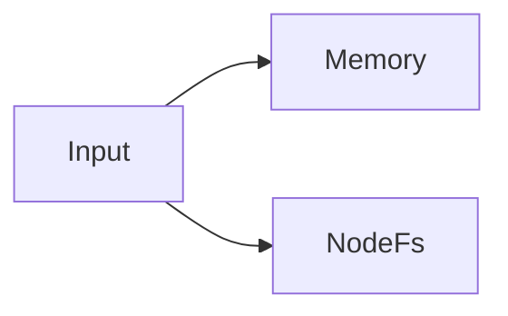
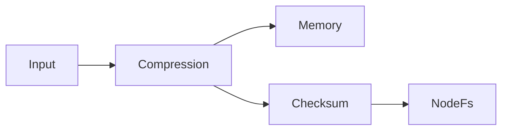
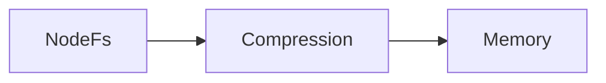

## Write and read principles [#principle]

When multiple Storages are registered, writes go to all of them in parallel. Reads search in registration order, decoding through the upstream pipeline of the found Storage.

```ts
const kvs = UniKvs.config<{ foo: Value<Uint8Array> }>()
  .appendStorage(new Memory())
  .appendStorage(new NodeFs(".tmp"))
  .create();
```

In the example above, `set` saves to both memory and files, while `get` prefers memory.



## Pipeline branching [#branching]

Each Storage uses the Transformers registered up to that point as its upstream pipeline. Adding them alternately applies different transformations per Storage.

```ts
const kvs = UniKvs.config<{ foo: Value<Uint8Array> }>()
  .appendTransformer(new Compression("gzip"))
  .appendStorage(new Memory()) // compression only
  .appendTransformer(new ChecksumSha256())
  .appendStorage(new NodeFs(".tmp")) // compression + checksum
  .create();
```



<CodeGroup>

```ts Caching with persistence
const kvs = UniKvs.config<{ foo: Value<Uint8Array> }>()
  .appendStorage(new Memory())
  .appendStorage(new NodeFs(".tmp"))
  .create();
```

```ts Switching by environment
const storages = process.env.NODE_ENV === "production"
  ? [new NodeFs(".data")]
  : [new Memory()];

const kvs = UniKvs.config<{ foo: Value<Uint8Array> }>()
  .appendStorage(storages[0])
  .create();
```

</CodeGroup>

- Combine a fast cache with a persistent primary destination.
- Use memory only during development, and add files or S3 in production.
- Add another destination for auditing to keep a recovery path.
- Wrap a destination with `@unikvs/writeonly` to keep an archive that cannot be modified.

## Write-back on read [#read-repair]

Pass `repair: true` to `get` and `stream` to write data found in a later storage back to earlier storages while decoding. Each storage's format is determined by the number of transformers at registration time, so the intermediate decoded value is already in the right format for its target. No re-encoding is needed.

```ts
const kvs = UniKvs.config<{ foo: Value<Uint8Array> }>()
  .appendStorage(new Memory()) // before compression
  .appendTransformer(new Compression("gzip"))
  .appendStorage(new NodeFs(".tmp")) // after compression
  .create();

// A value that only exists in NodeFs is restored and also written back to Memory.
const bytes = await kvs.get("foo", { repair: true });
```



- Only storages confirmed to be missing the key are written back to. Storages whose existence check itself failed are skipped.
- Write-back is best-effort. A failed write does not fail the read; it is only logged.
- Repair writes carry `unikvs:repair: true` in their runtime variables, so you can tell them apart from normal writes.
- To accept write-back on a storage, pass `allowRepair: true` to its constructor (disabled by default). Refused write-backs do not fail the read; they are only logged.
- Reading through write-back is serialized with writes to the same key. For `stream`, the write lock is held until the stream is fully read or disposed.
- It is disabled by default. Leave it off to avoid write amplification.

## Design notes [#notes]

:::warning
`clear` and `delete` apply to all registered Storages. To scope deletion differently, use separate clients.
:::

- Read priority follows registration order. Register fast destinations first.
- When combining compression and checksum, decide the order based on whether the checksum should cover data before or after compression.
- Partial write failures are reported as an aggregate error. See the errors and diagnostics page for details.
- Storages wrapped with `@unikvs/writeonly` ignore delete operations by default. Use them for destinations you want to exclude from deletion.
