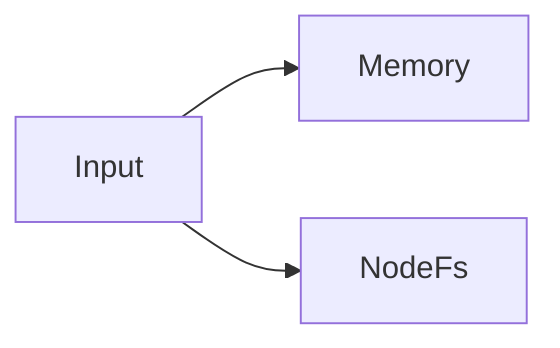
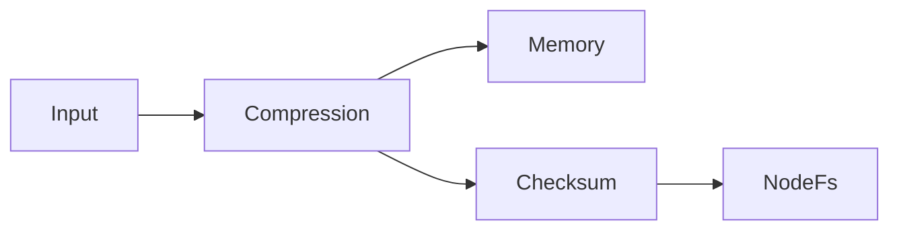

## Write and read principles [#principle]

When multiple Storages are registered, writes go to all Storages in parallel. Reads search in registration order, decoding through the upstream pipeline of the Storage where the key was found before returning it.

```ts
const kvs = UniKvs.config<{ foo: Value<Uint8Array> }>()
  .appendStorage(new Memory())
  .appendStorage(new NodeFs(".tmp"))
  .create();
```

In the example above, `set` saves to both memory and files. `get` prefers memory.



## Pipeline branching [#branching]

Each Storage uses the Transformers registered up to that point as its upstream pipeline. Adding them alternately lets you apply different transformations per Storage.

```ts
const kvs = UniKvs.config<{ foo: Value<Uint8Array> }>()
  .appendTransformer(new Compression("gzip"))
  .appendStorage(new Memory())
  .appendTransformer(new ChecksumSha256())
  .appendStorage(new NodeFs(".tmp"))
  .create();
```



- The memory side applies compression only.
- The file side applies compression and checksum verification.

Typical use cases are as follows.

<CodeGroup>

```ts Caching with persistence
const kvs = UniKvs.config<{ foo: Value<Uint8Array> }>()
  .appendStorage(new Memory())
  .appendStorage(new NodeFs(".tmp"))
  .create();
```

```ts Switching by environment
const storages = process.env.NODE_ENV === "production"
  ? [new NodeFs(".data")]
  : [new Memory()];

const kvs = UniKvs.config<{ foo: Value<Uint8Array> }>()
  .appendStorage(storages[0])
  .create();
```

</CodeGroup>

- Combine a fast read cache with a persistent primary destination.
- Use memory only during development, and add files or S3 in production.
- Add another destination for auditing to keep a recovery path in case of failure.

## Design notes [#notes]

:::warning
`clear` and `delete` apply to all registered Storages. If you want different deletion scopes for the primary destination and the cache, use separate clients.
:::

- Read priority follows registration order. Register fast destinations first.
- Transformer order affects the stored format. When combining compression and checksum, decide the order based on whether the checksum should cover data before or after compression.
- Partial write failures are reported as an aggregate error. See the errors and diagnostics page for details.
