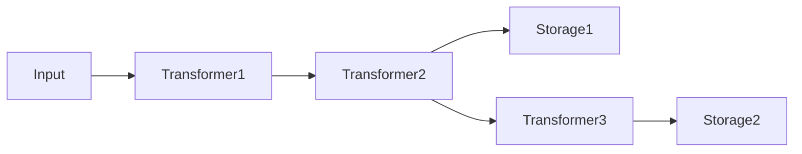

## Overview [#overview]

The package `unikvs` provides the main client of this repository. <Badge>Main Client</Badge> Assemble transformers and storages with the configuration builder (`UniKvs.config()` / `UniKvsConfig`), then read and write with the generated client (`UniKvs`).

Install with the following command.

```package-install
npm i unikvs
```

## Configuration Builder [#config-builder]

`UniKvs.config<T>()` creates a builder. The type parameter `T` is a mapping from keys to values (`{ [key]: PlainValue | StreamValue | Value }`), and controls which operations are available per key at the type level.

```ts
import { UniKvs, type Value } from "unikvs";

const kvs = UniKvs.config<{
  foo: Value<Uint8Array>;
}>()
  .appendStorage(storage)
  .create();
```

Configure in the following order.

<Steps>
  <Step title="`setVariables(vars)`">
    Sets the initial runtime variables (optional). Each call replaces the existing values.
  </Step>
  <Step title="`appendTransformer(transformer)`">
    Adds a transformer (optional). You can also add transformers after registering storages.
  </Step>
  <Step title="`appendStorage(storage)`">
    Adds a storage (required, and you can add more than one).
  </Step>
  <Step title="`create()`">
    Creates a `UniKvs` client. It throws `MissingStorageError` if no storage is registered.
  </Step>
</Steps>

:::warning[Caution: no storage registered]
Calling `create()` with no storage registered throws `MissingStorageError`. Call `appendStorage()` at least once before `create()`.
:::

Each storage uses the transformers added up to the point of registration as its dedicated upstream pipeline. Therefore, adding transformers and storages alternately builds a different pipeline per storage.

```ts
const kvs = UniKvs.config<{ foo: Value<Uint8Array> }>()
  .appendTransformer(transformer1)
  .appendTransformer(transformer2)
  .appendStorage(storage1)
  .appendTransformer(transformer3)
  .appendStorage(storage2)
  .create();
```

The configuration above results in the following pipelines.



:::note[Beware of pipeline branching]
As shown above, adding transformers and storages alternately builds a different upstream pipeline per storage. Check the diagram to see which storage goes through which transformers before configuring.
:::

Writes are fanned out to all storages in parallel. Reads decode by applying the upstream pipeline of the storage where the key was found in reverse order.

## Client Operations [#client-operations]

The created client provides the following operations. Initialize it with `open()` and close it with `close()` when you are done (automatic closing via `await using` is also available).

| Method          | Description                                        |
| --------------- | -------------------------------------------------- |
| `open()`          | Initializes the storages and transformers.           |
| `close()`         | Closes all storages and transformers.                |
| `set(key, value)` | Saves a value under a key.                           |
| `get(key)`        | Gets the value for a key.                            |
| `stream(key)`     | Gets a stream for a key.                             |
| `has(key)`        | Checks whether a key exists.                         |
| `delete(key)`     | Deletes a key.                                       |
| `clear()`         | Deletes all data.                                    |

All operations support `AbortSignal` cancellation and passing runtime variables (`vars`). Arguments can be specified either as an options object or as positional key and value arguments.

```ts
const ac = new AbortController();
setTimeout(() => ac.abort(), 1000);

await kvs.set("foo", new Uint8Array([0, 1, 2]), {
  signal: ac.signal,
  vars: { traceId: "abc-123" },
});

const bytes = await kvs.get("foo", { signal: ac.signal });
```

## Value Types [#value-types]

`PlainValue<T>` / `StreamValue<T>` / `Value<T>` are type-level markers that restrict the methods available per key.

| Type               | Write                              | Read            | Stream read                   |
| ------------------ | ---------------------------------- | --------------- | ----------------------------- |
| `PlainValue<T>`  | `set(key, T)`                      | `get(key): T` | Not available                 |
| `StreamValue<T>` | `set(key, T \| ReadableStream<T>)` | Not available | `stream(key): ValueStream<T>` |
| `Value<T>`       | `set(key, T \| ReadableStream<T>)` | `get(key): T` | `stream(key): ValueStream<T>` |

```ts
import { UniKvs, type PlainValue, type StreamValue } from "unikvs";

const kvs = UniKvs.config<{
  message: PlainValue<string>;
  logs: StreamValue<Uint8Array>;
}>()
  .appendStorage(storage)
  .create();

await kvs.open();

await kvs.set("message", "hello");
const msg = await kvs.get("message");
// msg is typed as string

await kvs.set("logs", new Uint8Array([0x01]));
const valueStream = await kvs.stream("logs");
```

Combinations that are not allowed result in type errors.

```ts
// Type error: stream() cannot be used on a PlainValue key
kvs.stream("message");

// Type error: get() cannot be used on a StreamValue key
kvs.get("logs");
```

## ValueStream [#value-stream]

The return value of `stream()` is `ValueStream<T>`, a <Badge variant="success">Stream capable</Badge> wrapper around `ReadableStream`. In addition to standard stream operations, it supports async iteration (`for await...of`) and async disposal (`await using` / `dispose()`). Disposing a stream you no longer need releases the read lock on the key.

<Tabs>
  <Tab title="getReader">

```ts
// Using getReader()
const reader = (await kvs.stream("logs")).getReader();
while (true) {
  const { done, value } = await reader.read();
  if (done) {
    break;
  }
  console.log(value); // Uint8Array
}
```

  </Tab>
  <Tab title="for-await">

```ts
// Using an async iterator
for await (const chunk of await kvs.stream("logs")) {
  console.log(chunk); // Uint8Array
}
```

  </Tab>
  <Tab title="await using">

```ts
// Using automatic disposal
await using (const valueStream = await kvs.stream("logs")) {
  const reader = valueStream.getReader();
  const { value } = await reader.read();
  console.log(value);
}
```

  </Tab>
</Tabs>

:::warning[Dispose streams when you are done]
When you are done with a `ValueStream`, dispose it to release the read lock on the key. Do not forget automatic disposal via `await using` or calling `dispose()`.
:::

## Variables and Cancellation [#variables-and-cancellation]

`vars` can be specified either as an object or as an entry array (`readonly [key, value][]`). The `vars` passed per operation are merged over the values set with the builder's `setVariables()`. In addition, `unikvs:action` and `unikvs:key` are automatically attached as variables representing the operation type and the target key.

```ts
// Set the base variables on the builder side
const kvs = UniKvs.config<{ foo: Value<Uint8Array> }>()
  .setVariables({ region: "ap-northeast-1" })
  .appendStorage(storage)
  .create();

await kvs.open();

// Per-operation vars overwrite the same keys
await kvs.set("foo", new Uint8Array([1]), {
  vars: { region: "us-east-1" },
});

// You can also use the array form
await kvs.get("foo", {
  vars: [["region", "us-east-1"]],
});
```

Cancellation is done with an `AbortSignal`. An interrupted operation fails with the abort reason.

```ts
const ac = new AbortController();
setTimeout(() => ac.abort(), 1000);

await kvs.set("foo", new Uint8Array([1]), { signal: ac.signal });
```

## Errors [#errors]

The main error classes are as follows.

| Error class                       | Description                                                              |
| --------------------------------- | ------------------------------------------------------------------------ |
| `KeyNotFoundError`                | Thrown when the specified key's data does not exist in any storage.        |
| `UniKvsIsNotOpenError`            | Thrown when an operation is performed while the client is not open.        |
| `UniKvsIsOpenError`               | Thrown when `open()` is called again on an already open client.            |
| `MissingStorageError`             | Thrown when `create()` is called with no storage registered.               |
| `StorageIsNotOpenError`           | Thrown when an operation is performed while the storage is not open.       |
| `TransformerIsNotOpenError`       | Thrown when an operation is performed while the transformer is not open.   |
| `PluginOperationAggregateError`   | Aggregate error when multiple plugin operations fail.                      |
| `InvalidInputError`               | Thrown when the input does not match the expected format.                  |
| `InvalidOutputError`              | Thrown when the output does not match the expected format.                 |
| `ReadableStreamNotSupportedError` | Thrown when the storage does not support read streams.                     |
| `WritableStreamNotSupportedError` | Thrown when the storage does not support write streams.                    |
| `EncodableStreamNotSupportedError` | Thrown when the transformer does not support encode streams.               |
| `DecodableStreamNotSupportedError` | Thrown when the transformer does not support decode streams.               |

```ts
import { KeyNotFoundError } from "unikvs";

try {
  const bytes = await kvs.get("missing-key");
} catch (ex) {
  if (ex instanceof KeyNotFoundError) {
    console.log("Key not found");
  } else {
    throw ex;
  }
}
```

See the cross-cutting documentation for detailed error classification and handling.

## Examples [#examples]

A minimal working example using `@unikvs/memory`.

```ts
import { Memory } from "@unikvs/memory";
import { UniKvs, type Value } from "unikvs";

const kvs = UniKvs.config<{
  foo: Value<Uint8Array>;
}>()
  .appendStorage(new Memory())
  .create();

await kvs.open();

await kvs.set("foo", new Uint8Array([0, 1, 2]));

const bytes = await kvs.get("foo");
console.log(bytes); // Uint8Array(3) [0, 1, 2]

console.log(await kvs.has("foo")); // true

await kvs.delete("foo");
await kvs.close();
```
