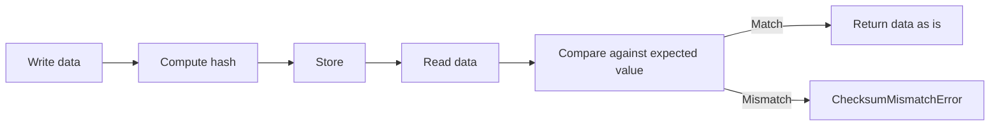

## Overview [#overview]

`@unikvs/checksum` provides transformers that compute the hash value of a byte array and compare it against the expected value set in variables. The data itself is left unchanged, and on successful verification the input data is returned as is.

The six supported algorithms are as follows.

| Algorithm | Class | Variable key |
| --- | --- | --- |
| MD5 | `ChecksumMd5` | `@unikvs/checksum:md5` |
| SHA-1 | `ChecksumSha1` | `@unikvs/checksum:sha1` |
| SHA-224 | `ChecksumSha224` | `@unikvs/checksum:sha224` |
| SHA-256 | `ChecksumSha256` | `@unikvs/checksum:sha256` |
| SHA-384 | `ChecksumSha384` | `@unikvs/checksum:sha384` |
| SHA-512 | `ChecksumSha512` | `@unikvs/checksum:sha512` |

Install it as follows. The actual hash computation is provided by the peer dependency `@noble/hashes`.

```package-install
npm i @unikvs/checksum @noble/hashes@2.0.0
```

`package.json` lists `2.0.0` of `@noble/hashes` and `2.0.0` of `@logtape/logtape` as `peerDependencies`. Install both to suit your environment.

## Class List [#classes]

The base class is the abstract class `Checksum`. The subclasses for each algorithm are presets with a fixed name, hash function, and variable key.

| Class | Role | Value passed to the constructor |
| --- | --- | --- |
| `Checksum` | The abstract base class. Takes `name`, `hash`, and `options`. | Direct instantiation with `new` is not intended. |
| `ChecksumMd5` | A preset for MD5. | Only `options?: ChecksumMd5Options`. |
| `ChecksumSha1` | A preset for SHA-1. | Only `options?: ChecksumSha1Options`. |
| `ChecksumSha224` | A preset for SHA-224. | Only `options?: ChecksumSha224Options`. |
| `ChecksumSha256` | A preset for SHA-256. | Only `options?: ChecksumSha256Options`. |
| `ChecksumSha384` | A preset for SHA-384. | Only `options?: ChecksumSha384Options`. |
| `ChecksumSha512` | A preset for SHA-512. | Only `options?: ChecksumSha512Options`. |

Each subclass implementation just passes fixed values to `super`. For example, `ChecksumSha256` uses the name `"ChecksumSha256"` and the `sha256` function, and defines `"@unikvs/checksum:sha256"` as `CHECKSUM_VAR_NAME`. `ChecksumMd5` and `ChecksumSha1` use `md5` and `sha1` from `@noble/hashes/legacy.js`, while `ChecksumSha224`, `ChecksumSha256`, `ChecksumSha384`, and `ChecksumSha512` use the respective functions from `@noble/hashes/sha2.js`.

The options type is based on `ChecksumOptions`. The `ChecksumMd5Options` and similar types for each subclass have the same shape as `ChecksumOptions`.

```ts
type ChecksumOptions = {
  readonly required?: boolean | undefined;
};
```

When `required` is omitted, it is treated as `false`. The `name` property holds the fixed name of each subclass. `isOpen` always returns `true`.

<Accordion>
  <AccordionItem title="Checksum">
The abstract base class. Takes `name`, `hash`, and `options`. Direct instantiation with `new` is not intended.
  </AccordionItem>
  <AccordionItem title="ChecksumMd5">
A preset for MD5. Pass only `options?: ChecksumMd5Options` to the constructor. Its variable key is `@unikvs/checksum:md5`. It uses `md5` from `@noble/hashes/legacy.js` as the hash function.
  </AccordionItem>
  <AccordionItem title="ChecksumSha1">
A preset for SHA-1. Pass only `options?: ChecksumSha1Options` to the constructor. Its variable key is `@unikvs/checksum:sha1`. It uses `sha1` from `@noble/hashes/legacy.js` as the hash function.
  </AccordionItem>
  <AccordionItem title="ChecksumSha224">
A preset for SHA-224. Pass only `options?: ChecksumSha224Options` to the constructor. Its variable key is `@unikvs/checksum:sha224`. It uses `sha224` from `@noble/hashes/sha2.js` as the hash function.
  </AccordionItem>
  <AccordionItem title="ChecksumSha256">
A preset for SHA-256. Pass only `options?: ChecksumSha256Options` to the constructor. Its variable key is `@unikvs/checksum:sha256`. It uses `sha256` from `@noble/hashes/sha2.js` as the hash function.
  </AccordionItem>
  <AccordionItem title="ChecksumSha384">
A preset for SHA-384. Pass only `options?: ChecksumSha384Options` to the constructor. Its variable key is `@unikvs/checksum:sha384`. It uses `sha384` from `@noble/hashes/sha2.js` as the hash function.
  </AccordionItem>
  <AccordionItem title="ChecksumSha512">
A preset for SHA-512. Pass only `options?: ChecksumSha512Options` to the constructor. Its variable key is `@unikvs/checksum:sha512`. It uses `sha512` from `@noble/hashes/sha2.js` as the hash function.
  </AccordionItem>
</Accordion>

## Usage [#usage]

Subclasses can be created with options only. The base class `Checksum` requires a `name` and an `IHash`-compatible hash function, so normally use a subclass.

```ts
import { ChecksumSha256 } from "@unikvs/checksum";

const optional = new ChecksumSha256();
const required = new ChecksumSha256({ required: true });
```

Set the expected hash value as a hex string under the per-class key in the runtime variables `vars`. The key is fixed per class. For `ChecksumSha256`, use `ChecksumSha256.CHECKSUM_VAR_NAME`, that is, `"@unikvs/checksum:sha256"`.

:::tip
When specifying the expected value, reference it from the static property such as `ChecksumSha256.CHECKSUM_VAR_NAME` instead of writing the key string directly. This prevents mismatches between the class and the variable key.
:::

```ts
const vars = {
  "@unikvs/checksum:sha256":
    "9f86d081884c7d659a2feaa0c55ad015a3bf4f1b2b0b822cd15d6c15b0f00a08",
};

const result = optional.encode({ vars, data });
```

To embed it as a transformer, register it with the builder as an `ITransformer`.

```ts
import { ChecksumSha256 } from "@unikvs/checksum";

const transformer = new ChecksumSha256({ required: true });

builder.appendTransformer(transformer);
```

The `builder` above refers to the configuration builder returned by `UniKvs.config()`. Follow the builder specification for registering storages and similar steps. Pass the variables used for verification at runtime as `vars`.

## Verification Mechanism [#verification]

Both `encode` and `decode` perform the same bulk verification. Both `getEncodable` and `getDecodable` perform the same stream verification. Writes and reads are not distinguished.

The bulk verification flow is as follows.

1. Get the value corresponding to the `CHECKSUM_VAR_NAME` defined by the subclass from `vars`.
2. If the value is a string, compute `this.hash(data)`, convert it to a hex string with `bytesToHex`, and compare. If they do not match, throw `ChecksumMismatchError`.
3. If the value is not a string, throw `ChecksumRequiredError` when `required` is `true`. When `required` is `false`, skip hash computation and return the data as is.
4. Even on successful verification, return the data as is.

The stream verification flow is as follows.

1. Take the expected value from `vars`. If the value is not a string, throw `ChecksumRequiredError` when `required` is `true`. When `required` is `false`, return a pass-through `TransformStream` that does not use the hash function.
2. If the value is a string, create an `IHasher` with `this.hash.create()`.
3. Each time a chunk arrives, call `hasher.update` while splitting into `MAX_CHUNK_SIZE` units of 4 GB, and pass the split chunks downstream as is.
4. On stream completion, in `flush`, convert `hasher.digest()` to a hex string and compare it against the expected value. If they do not match, throw `ChecksumMismatchError`.



## Errors [#errors]

This package throws the following three errors.

| Error | Meaning | Handling |
| --- | --- | --- |
| `ChecksumMismatchError` | The computed hash value does not match the expected value. Includes `actual` and `expected` in `meta`. | Check for a mistake in the expected value or data corruption. |
| `ChecksumRequiredError` | `required` is `true`, yet `vars` has no string checksum. | Set a hex string under the corresponding variable key, or set `required` to `false`. |
| `ChecksumInvalidVarNameError` | `CHECKSUM_VAR_NAME` is not a string. Includes `actual` in `meta`. | If you extended the base class yourself, check the static property definition. This does not occur with the normal subclasses. |

`ChecksumMismatchError` is thrown on `encode` and `decode` calls for bulk verification. For stream verification, it is thrown in the completion handler `flush`.

:::danger
If `ChecksumMismatchError` is thrown, do not continue processing as is; check for a mistake in the expected value or data corruption. Comparing `actual` and `expected` in `meta` helps isolate the cause.
:::

```ts
import {
  ChecksumMismatchError,
  ChecksumRequiredError,
} from "@unikvs/checksum";

try {
  transformer.encode({ vars, data });
} catch (error) {
  if (error instanceof ChecksumMismatchError) {
    console.log(error.meta.actual);
    console.log(error.meta.expected);
  } else if (error instanceof ChecksumRequiredError) {
    console.log("No checksum specified.");
  } else {
    throw error;
  }
}
```

## Subpath Exports [#exports]

`package.json` `exports` defines the following subpaths. Import them individually for your use case.

| Subpath | Contents |
| --- | --- |
| `.` | Re-exports all classes and all errors. |
| `./checksum` | Outputs the base class `Checksum` and related types. |
| `./errors` | Outputs `ChecksumMismatchError`, `ChecksumRequiredError`, and `ChecksumInvalidVarNameError`. |
| `./md5` | Outputs `ChecksumMd5`. |
| `./sha1` | Outputs `ChecksumSha1`. |
| `./sha224` | Outputs `ChecksumSha224`. |
| `./sha256` | Outputs `ChecksumSha256`. |
| `./sha384` | Outputs `ChecksumSha384`. |
| `./sha512` | Outputs `ChecksumSha512`. |

<CodeGroup>

```ts Base class
import Checksum from "@unikvs/checksum/checksum";
```

```ts MD5
import ChecksumMd5 from "@unikvs/checksum/md5";
```

```ts SHA-1
import ChecksumSha1 from "@unikvs/checksum/sha1";
```

```ts SHA-224
import ChecksumSha224 from "@unikvs/checksum/sha224";
```

```ts SHA-256
import ChecksumSha256 from "@unikvs/checksum/sha256";
```

```ts SHA-384
import ChecksumSha384 from "@unikvs/checksum/sha384";
```

```ts SHA-512
import ChecksumSha512 from "@unikvs/checksum/sha512";
```

```ts Errors
import {
  ChecksumMismatchError,
  ChecksumRequiredError,
  ChecksumInvalidVarNameError,
} from "@unikvs/checksum/errors";
```

</CodeGroup>

The default setup uses the root specifier.

```ts
import { ChecksumSha256 } from "@unikvs/checksum";
```

## Examples [#examples]

The following example is a minimal bulk verification with `ChecksumSha256`. It uses the SHA-256 hash of the string `"test"`.

```ts
import { ChecksumSha256, ChecksumMismatchError } from "@unikvs/checksum";

const transformer = new ChecksumSha256();
const data = new TextEncoder().encode("test");
const vars = {
  [ChecksumSha256.CHECKSUM_VAR_NAME]:
    "9f86d081884c7d659a2feaa0c55ad015a3bf4f1b2b0b822cd15d6c15b0f00a08",
};

const verified = transformer.encode({ vars, data });
console.log(verified);

try {
  transformer.encode({
    vars: { [ChecksumSha256.CHECKSUM_VAR_NAME]: "0".repeat(64) },
    data,
  });
} catch (error) {
  if (error instanceof ChecksumMismatchError) {
    console.log(`expected: ${error.meta.expected}`);
    console.log(`actual: ${error.meta.actual}`);
  } else {
    throw error;
  }
}
```
