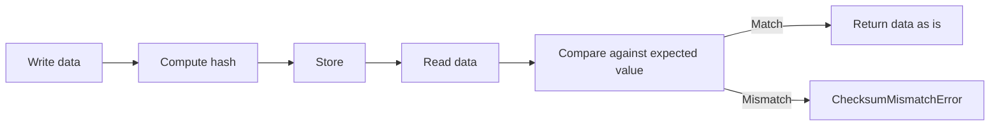

## Overview [#overview]

`@unikvs/checksum` provides transformers that compute the hash of a byte array and compare it against the expected value in variables. Data is left unchanged, and on success the input is returned as is.

The six supported algorithms are as follows.

| Algorithm | Class | Variable key | Hash function |
| --- | --- | --- | --- |
| MD5 | `ChecksumMd5` | `@unikvs/checksum:md5` | `md5` from `@noble/hashes/legacy.js`. |
| SHA-1 | `ChecksumSha1` | `@unikvs/checksum:sha1` | `sha1` from `@noble/hashes/legacy.js`. |
| SHA-224 | `ChecksumSha224` | `@unikvs/checksum:sha224` | `sha224` from `@noble/hashes/sha2.js`. |
| SHA-256 | `ChecksumSha256` | `@unikvs/checksum:sha256` | `sha256` from `@noble/hashes/sha2.js`. |
| SHA-384 | `ChecksumSha384` | `@unikvs/checksum:sha384` | `sha384` from `@noble/hashes/sha2.js`. |
| SHA-512 | `ChecksumSha512` | `@unikvs/checksum:sha512` | `sha512` from `@noble/hashes/sha2.js`. |

Install it as follows. The actual hash computation is provided by the peer dependency `@noble/hashes`.

```package-install
npm i @unikvs/checksum @noble/hashes@2.0.0
```

`package.json` lists `2.0.0` of `@noble/hashes` and `2.0.0` of `@logtape/logtape` as `peerDependencies`. Install both to suit your environment.

## Class List [#classes]

The base class is the abstract class `Checksum`. Each subclass is a preset with a fixed name, hash function, and variable key. Direct `new` is not intended.

| Class | Value passed to the constructor |
| --- | --- |
| `Checksum` | Direct instantiation is not intended. |
| `ChecksumMd5` | Only `options?: ChecksumMd5Options`. |
| `ChecksumSha1` | Only `options?: ChecksumSha1Options`. |
| `ChecksumSha224` | Only `options?: ChecksumSha224Options`. |
| `ChecksumSha256` | Only `options?: ChecksumSha256Options`. |
| `ChecksumSha384` | Only `options?: ChecksumSha384Options`. |
| `ChecksumSha512` | Only `options?: ChecksumSha512Options`. |

For example, `ChecksumSha256` fixes the name `"ChecksumSha256"`, the `sha256` function, and `"@unikvs/checksum:sha256"` as `CHECKSUM_VAR_NAME`.

The options type is based on `ChecksumOptions`. Each subclass type has the same shape.

```ts
type ChecksumOptions = {
  readonly required?: boolean | undefined;
};
```

When `required` is omitted, it is treated as `false`. The `name` property holds the fixed name of each subclass. `isOpen` always returns `true`.

## Usage [#usage]

Subclasses can be created with options only. Normally use a subclass.

```ts
import { ChecksumSha256 } from "@unikvs/checksum";

const optional = new ChecksumSha256();
const required = new ChecksumSha256({ required: true });
```

Set the expected hash as a hex string under the per-class key in `vars`. The key is fixed per class. For `ChecksumSha256`, use `ChecksumSha256.CHECKSUM_VAR_NAME`, that is, `"@unikvs/checksum:sha256"`.

:::tip
Reference the key from the static property such as `ChecksumSha256.CHECKSUM_VAR_NAME` instead of writing it directly. This prevents class/key mismatches.
:::

```ts
const vars = {
  "@unikvs/checksum:sha256":
    "9f86d081884c7d659a2feaa0c55ad015a3bf4f1b2b0b822cd15d6c15b0f00a08",
};

const result = optional.encode({ vars, data });
```

To embed it as a transformer, register it with the builder.

```ts
import { ChecksumSha256 } from "@unikvs/checksum";

const transformer = new ChecksumSha256({ required: true });

builder.appendTransformer(transformer);
```

The `builder` above is the config builder from `UniKvs.config()`. Pass verification variables at runtime as `vars`.

## Verification Mechanism [#verification]

Both `encode` and `decode` perform the same bulk verification. Both `getEncodable` and `getDecodable` perform the same stream verification. Writes and reads are not distinguished.

The bulk verification flow is as follows.

1. Get the value for the subclass `CHECKSUM_VAR_NAME` from `vars`.
2. If the value is a string, compute the hash, convert it to hex, and compare. On mismatch, throw `ChecksumMismatchError`.
3. If the value is not a string, throw `ChecksumRequiredError` when `required` is `true`. When `required` is `false`, skip computation and return the data as is.
4. Even on success, return the data as is.

The stream verification flow is as follows.

1. Take the expected value from `vars`. If it is not a string, throw `ChecksumRequiredError` when `required` is `true`. When `required` is `false`, return a pass-through `TransformStream`.
2. If it is a string, create an `IHasher` with `this.hash.create()`.
3. On each chunk, call `hasher.update` while splitting into 4 GB units, passing split chunks downstream as is.
4. On completion in `flush`, convert `hasher.digest()` to hex and compare. On mismatch, throw `ChecksumMismatchError`.



## Errors [#errors]

This package throws the following three errors.

| Error | Meaning | Handling |
| --- | --- | --- |
| `ChecksumMismatchError` | The computed hash does not match the expected value. Includes `actual` and `expected` in `meta`. | Check the expected value or data corruption. |
| `ChecksumRequiredError` | `required` is `true`, yet `vars` has no string checksum. | Set a hex string under the key, or set `required` to `false`. |
| `ChecksumInvalidVarNameError` | `CHECKSUM_VAR_NAME` is not a string. This does not occur with the normal subclasses. | If you extended the base class, check the static property. |

`ChecksumMismatchError` is thrown on `encode`/`decode` for bulk verification, and in `flush` for stream verification.

:::danger
On mismatch, don't continue; compare `actual` and `expected` in `meta` to isolate the cause.
:::

```ts
import {
  ChecksumMismatchError,
  ChecksumRequiredError,
} from "@unikvs/checksum";

try {
  transformer.encode({ vars, data });
} catch (error) {
  if (error instanceof ChecksumMismatchError) {
    console.log(error.meta.actual);
    console.log(error.meta.expected);
  } else if (error instanceof ChecksumRequiredError) {
    console.log("No checksum specified.");
  } else {
    throw error;
  }
}
```

## Subpath Exports [#exports]

You can use the subpaths in `package.json` `exports`.

| Subpath | Contents |
| --- | --- |
| `.` | Re-exports all classes and all errors. |
| `./checksum` | Outputs the base class `Checksum` and related types. |
| `./errors` | Outputs `ChecksumMismatchError`, `ChecksumRequiredError`, and `ChecksumInvalidVarNameError`. |
| `./md5` | Outputs `ChecksumMd5`. |
| `./sha1` | Outputs `ChecksumSha1`. |
| `./sha224` | Outputs `ChecksumSha224`. |
| `./sha256` | Outputs `ChecksumSha256`. |
| `./sha384` | Outputs `ChecksumSha384`. |
| `./sha512` | Outputs `ChecksumSha512`. |

<CodeGroup>

```ts Base class
import Checksum from "@unikvs/checksum/checksum";
```

```ts MD5
import ChecksumMd5 from "@unikvs/checksum/md5";
```

```ts SHA-1
import ChecksumSha1 from "@unikvs/checksum/sha1";
```

```ts SHA-224
import ChecksumSha224 from "@unikvs/checksum/sha224";
```

```ts SHA-256
import ChecksumSha256 from "@unikvs/checksum/sha256";
```

```ts SHA-384
import ChecksumSha384 from "@unikvs/checksum/sha384";
```

```ts SHA-512
import ChecksumSha512 from "@unikvs/checksum/sha512";
```

```ts Errors
import {
  ChecksumMismatchError,
  ChecksumRequiredError,
  ChecksumInvalidVarNameError,
} from "@unikvs/checksum/errors";
```

</CodeGroup>

The default setup uses the root specifier.

```ts
import { ChecksumSha256 } from "@unikvs/checksum";
```

## Examples [#examples]

A minimal bulk verification with `ChecksumSha256`. It uses the SHA-256 hash of `"test"`.

```ts
import { ChecksumSha256, ChecksumMismatchError } from "@unikvs/checksum";

const transformer = new ChecksumSha256();
const data = new TextEncoder().encode("test");
const vars = {
  [ChecksumSha256.CHECKSUM_VAR_NAME]:
    "9f86d081884c7d659a2feaa0c55ad015a3bf4f1b2b0b822cd15d6c15b0f00a08",
};

const verified = transformer.encode({ vars, data });
console.log(verified);

try {
  transformer.encode({
    vars: { [ChecksumSha256.CHECKSUM_VAR_NAME]: "0".repeat(64) },
    data,
  });
} catch (error) {
  if (error instanceof ChecksumMismatchError) {
    console.log(`expected: ${error.meta.expected}`);
    console.log(`actual: ${error.meta.actual}`);
  } else {
    throw error;
  }
}
```
