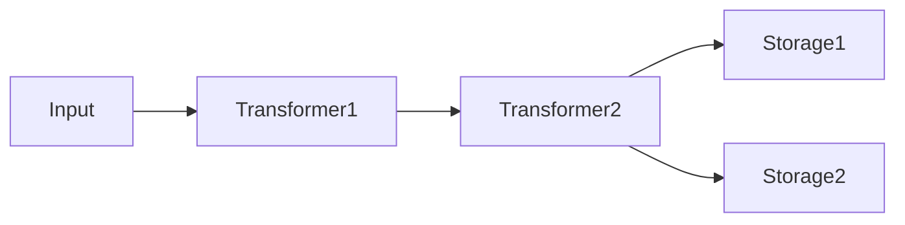
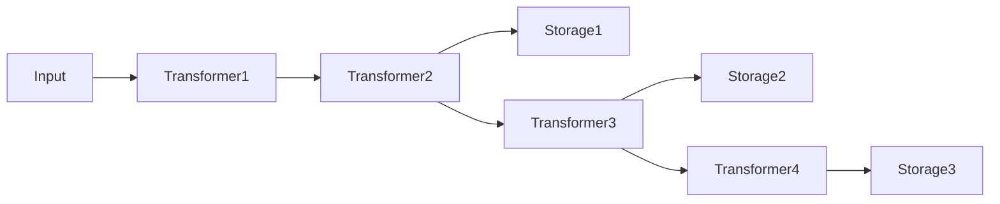

## アーキテクチャー [#architecture]

unikvs はビルダーパターンで構成します。入力はトランスフォーマーの列を通り、ストレージに届きます。



役割は次の 2 つです。

- トランスフォーマーは、データのエンコード・デコードを透過的に行います。
- ストレージは永続化先です。複数指定すると、すべてに並列で書き込みます。

各ストレージは、登録時点までのトランスフォーマーを前段パイプラインとして使います。交互に追加すると、ストレージごとに異なるパイプラインになります。

```ts
const kvs = UniKvs.config()
  .appendTransformer(new Transformer1())
  .appendTransformer(new Transformer2())
  .appendStorage(new Storage1())
  .appendTransformer(new Transformer3())
  .appendStorage(new Storage2())
  .appendTransformer(new Transformer4())
  .appendStorage(new Storage3())
  .create();
```



読み取り時は、見つかったストレージの前段パイプラインを逆順に適用してデコードします。

:::note
書き込みはすべてに並列で行い、読み取りは登録順に探して最初に見つけたキーで返します。高速な保存先を先に登録すると読み取りが速くなります。
:::

## 設定ビルダー [#config-builder]

`UniKvs.config()` でビルダーを作り、次の順序で設定します。`schema` を渡すと Valibot スキーマによる入出力検証が有効になり、キーと値のマッピング型も自動推論します。

```ts
import { PlainValue, StreamValue, UniKvs } from "unikvs";
import * as v from "valibot";

const kvs = UniKvs.config({
  schema: {
    message: PlainValue(v.string()),
    logs: StreamValue(v.instance(Uint8Array)),
  },
})
  .appendStorage(storage)
  .create();
```

Valibot スキーマを使う場合は `valibot` を別途インストールします。`schema` を省略した場合は、従来どおり型パラメーターでマッピングを指定します。この場合は型チェックのみで、実行時の検証は行いません。

<Steps>
  <Step title="setVariables(vars)">
    実行時変数を設定します (任意)。
  </Step>
  <Step title="appendTransformer(transformer)">
    トランスフォーマーを追加します (任意)。ストレージ登録後にも追加できます。
  </Step>
  <Step title="appendStorage(storage)">
    ストレージを追加します (必須、複数可)。
  </Step>
  <Step title="create()">
    KVS クライアントを作ります。
  </Step>
</Steps>

## クライアント操作 [#client-operations]

| メソッド | 説明 |
| --- | --- |
| `open()` | ストレージとトランスフォーマーを初期化します。 |
| `close()` | すべてのストレージとトランスフォーマーをクローズします。 |
| `set(key, value)` | キーに値を保存します。 |
| `get(key)` | キーから値を取得します。 |
| `stream(key)` | キーからストリームを取得します。 |
| `has(key)` | キーが存在するかを確認します。 |
| `delete(key)` | キーを削除します。 |
| `clear()` | すべてのデータを削除します。 |

すべての操作は `AbortSignal` によるキャンセルと、実行時変数の受け渡しに対応します。

データ操作 (`set` / `get` / `stream` / `has` / `delete` / `clear`) は、グローバル読み取りロックとキー単位のロックを使います。別キーの操作は互いにブロックしません。同じキーの読み書きは直列化されるため、キー単位で一貫した結果が得られます。`stream` が返す `ValueStream` は、破棄されるか読み切られるまでそのキーの読み取りロックを保持し、同じキーへの書き込みを待たせます。`get` と `stream` の `repair` を有効にした場合は、読み取りの間そのキーの書き込みロックを保持します。`clear` と `open` / `close` は排他ロックを使い、進行中の操作が完了するまで待ちます。

## 値の型 [#value-types]

`Value`・`PlainValue`・`StreamValue` は型と関数の両方です。型として使うとキーごとに使えるメソッドが型レベルで決まり、関数として使うと Valibot スキーマから型を推論しつつ実行時の検証も行います。

| 型 | 書き込み | 読み取り | ストリーム読み取り |
| --- | --- | --- | --- |
| `PlainValue<T>` | `set(key, T)` | `get(key): T` | 不可。 |
| `StreamValue<T>` | `set(key, T \| ReadableStream<T>)` | 不可。 | `stream(key): ValueStream<T>` |
| `Value<T>` | `set(key, T \| ReadableStream<T>)` | `get(key): T` | `stream(key): ValueStream<T>` |

`Value<T>` は両方に対応する糖衣構文で、`PlainValue<T> | StreamValue<T>` と等価です。`v.transform()` のように入力と出力の型が変わるスキーマでは、第 2 型パラメーターが `set` の入力型になります (`PlainValue<TData, TInput>`)。

<Tabs>
  <Tab title="PlainValue">
    単一値の保存と取得に使います。`stream()` は型エラーです。

    ```ts
    import { UniKvs, type PlainValue } from "unikvs";

    const kvs = UniKvs.config<{
      message: PlainValue<string>;
    }>()
      .appendStorage(storage)
      .create();

    await kvs.set("message", "hello");
    const msg = await kvs.get("message");
    ```
  </Tab>
  <Tab title="StreamValue">
    大規模データの逐次処理に使います。`get()` は型エラーです。

    ```ts
    import { UniKvs, type StreamValue } from "unikvs";

    const kvs = UniKvs.config<{
      logs: StreamValue<Uint8Array>;
    }>()
      .appendStorage(storage)
      .create();

    await kvs.set("logs", new Uint8Array([0x01]));
    const valueStream = await kvs.stream("logs");
    ```
  </Tab>
  <Tab title="Value">
    両方に対応する糖衣構文で、`PlainValue<T> | StreamValue<T>` と等価です。

    ```ts
    import { UniKvs, type Value } from "unikvs";

    const kvs = UniKvs.config<{
      blob: Value<Uint8Array>;
    }>()
      .appendStorage(storage)
      .create();

    await kvs.set("blob", new Uint8Array([1, 2, 3]));
    const all = await kvs.get("blob");
    const valueStream = await kvs.stream("blob");
    ```
  </Tab>
</Tabs>

### スキーマ定義 [#schema-definition]

`UniKvs.config({ schema })` に渡すと、Valibot スキーマからマッピング型を推論し、入出力値を実行時に検証します。

<Tabs>
  <Tab title="オブジェクト形式">
    キーをそのままキーとして扱います。固定キーに使います。

    ```ts
    import { PlainValue, StreamValue, UniKvs } from "unikvs";
    import * as v from "valibot";

    const kvs = UniKvs.config({
      schema: {
        message: PlainValue(v.pipe(v.string(), v.minLength(1))),
        logs: StreamValue(v.instance(Uint8Array)),
      },
    })
      .appendStorage(storage)
      .create();

    await kvs.set("message", "hello");
    const msg = await kvs.get("message");
    // msg は string 型になります
    ```
  </Tab>
  <Tab title="配列形式">
    キースキーマと値スキーマの組を並べます。動的キーに使います。最初に一致した定義を採用します。

    ```ts
    import { PlainValue, StreamValue, UniKvs } from "unikvs";
    import * as v from "valibot";

    const kvs = UniKvs.config({
      schema: [
        [v.pipe(v.string(), v.regex(/^msg-.+/)), PlainValue(v.string())],
        [v.pipe(v.string(), v.regex(/^img-.+/)), StreamValue(v.instance(Uint8Array))],
      ],
    })
      .appendStorage(storage)
      .create();

    await kvs.set("msg-1", "hello");
    ```
  </Tab>
</Tabs>

:::warning[スキーマ定義が不正な場合]
`PlainValue()`・`StreamValue()`・`Value()` 以外を値に指定するなど、`schema` の形式が不正な場合は `config()` の時点で `InvalidInputError` を投げます。
:::

### 検証のタイミング [#schema-validation]

検証はトランスフォーマーの外側、つまり UniKvs の入出力で行います。`set` ではエンコード前に入力を検証し、`get`・`stream` ではデコード後に出力を検証します。

| 操作 | 検証内容 | 失敗時のエラー |
| --- | --- | --- |
| `set` | 入力値または入力チャンクを検証します。`v.transform()` などの変換結果が後段に流れます。ストリームはチャンクごとに検証します。 | `InvalidInputError`。ストリーム書き込みのチャンク不良は `PluginOperationAggregateError` に包まれます。 |
| `get` | デコード後の値を検証します。 | `InvalidOutputError` |
| `stream` | デコード後のチャンクを 1 つずつ検証します。 | `InvalidOutputError` |
| `has`・`delete` | 配列形式の場合のみ、キーがキースキーマに一致するかを検証します。 | `InvalidInputError` |

プレーン専用のキーに `ReadableStream` を渡した場合や、ストリーム専用のキーにプレーン値を渡した場合は、型エラーに加えて実行時も `InvalidInputError` を投げます。配列形式でどのキースキーマにも一致しないキーも `InvalidInputError` です。

## 実行時変数 [#variables]

変数は操作の挙動を切り替える実行時コンテキストです。ビルダーの `setVariables()` で初期値を設定し、操作ごとの `vars` で上書きできます。

```ts
const kvs = UniKvs.config<{ foo: Value<Uint8Array> }>()
  .setVariables({ region: "ap-northeast-1" })
  .appendStorage(storage)
  .create();

await kvs.set("foo", new Uint8Array([1]), {
  vars: { region: "us-east-1" },
});
```

<Expandable title="自動的に付与される変数">
操作の種類と対象キーは、`unikvs:action` と `unikvs:key` として自動付与します。一部のトランスフォーマーは変数を使います。詳細は各パッケージリファレンスを参照してください。
</Expandable>

## プラグインの種類 [#plugin-kinds]

| 種別 | パッケージ | 説明 |
| --- | --- | --- |
| トランスフォーマー | `@unikvs/compression` | gzip・deflate・deflate-raw による圧縮と展開を行います。 |
| トランスフォーマー | `@unikvs/checksum` | MD5・SHA-1・SHA-224・SHA-256・SHA-384・SHA-512 の検証を行います。 |
| トランスフォーマー | `@unikvs/debug` | 読み書きされる操作とキーとデータのデバッグ情報をログに記録します。 |
| トランスフォーマー | `@unikvs/passthrough` | データを何も変換せずそのまま透過させます。 |
| トランスフォーマー | `@unikvs/json` | 値を JSON に、ストリームでは JSON Lines に変換します。 |
| トランスフォーマー | `@unikvs/superjson` | Date・Map・Set・BigInt・undefined を保持したまま SuperJSON で変換します。 |
| トランスフォーマー | `@unikvs/cbor` | 値を CBOR に、ストリームでは CBOR シーケンスに変換します。 |
| ストレージ | `@unikvs/memory` | メモリー上に保存します。すべての環境に対応します。 |
| ストレージ | `@unikvs/fs.node` | ローカルファイルシステムに保存します。Node.js 専用です。 |
| ストレージ | `@unikvs/fs.bun` | ローカルファイルシステムに保存します。Bun 専用です。 |
| ストレージ | `@unikvs/redis.bun` | Redis に保存します。Bun 専用です。 |
| ストレージ | `@unikvs/s3.node` | S3 互換のオブジェクトストレージに保存します。Node.js 専用です。 |
| ストレージ | `@unikvs/s3.bun` | S3 互換のオブジェクトストレージに保存します。Bun 専用です。 |
| ストレージ | `@unikvs/indexeddb` | ブラウザーの IndexedDB に保存します。 |
| ストレージ | `@unikvs/opfs` | ブラウザーの OPFS に保存します。 |
| ストレージ | `@unikvs/writeonly` | 既存のストレージを書き込み専用にします。 |

:::tip
自作方法は自作プラグインのガイドを参照してください。ストレージは `IStorage`、トランスフォーマーは `ITransformer` から始めます。
:::
