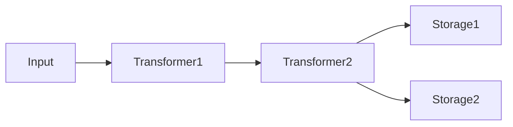
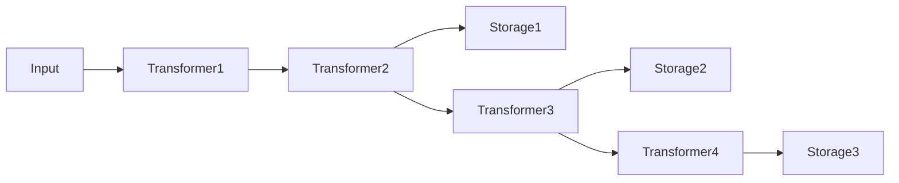

## アーキテクチャー [#architecture]

unikvsはビルダーパターンで構成されます。入力はトランスフォーマーの列を通過し、ストレージに到達します。



役割は次の2つです。

- トランスフォーマーは、データのエンコードとデコードを透過的に行います。
- ストレージは、データの永続化先です。複数指定すると、すべてのストレージに並列で書き込まれます。

各ストレージは、登録時点までに追加されたトランスフォーマーを前段パイプラインとして使います。そのため、トランスフォーマーとストレージを交互に追加すると、ストレージごとに異なるパイプラインを構成できます。

```ts
const kvs = UniKvs.config()
  .appendTransformer(new Transformer1())
  .appendTransformer(new Transformer2())
  .appendStorage(new Storage1())
  .appendTransformer(new Transformer3())
  .appendStorage(new Storage2())
  .appendTransformer(new Transformer4())
  .appendStorage(new Storage3())
  .create();
```



読み取り時は、キーが見つかったストレージの前段パイプラインを逆順に適用してデコードします。

:::note
書き込みはすべてのストレージに並列で行われ、読み取りは登録順に探索して最初に見つかったキーでデコードして返します。高速な保存先を先に登録すると読み取りが速くなります。
:::

## 設定ビルダー [#config-builder]

`UniKvs.config()` でビルダーを作成し、次の順序で設定します。

<Steps>
  <Step title="setVariables(vars)">
    実行時変数を設定します。省略可能です。
  </Step>
  <Step title="appendTransformer(transformer)">
    トランスフォーマーを追加します。省略可能であり、ストレージの登録後にも追加できます。
  </Step>
  <Step title="appendStorage(storage)">
    ストレージを追加します。必須であり、複数追加できます。
  </Step>
  <Step title="create()">
    KVSクライアントを作成します。
  </Step>
</Steps>

## クライアント操作 [#client-operations]

| メソッド | 説明 |
| --- | --- |
| `open()` | ストレージとトランスフォーマーを初期化します。 |
| `close()` | すべてのストレージとトランスフォーマーをクローズします。 |
| `set(key, value)` | キーに値を保存します。 |
| `get(key)` | キーから値を取得します。 |
| `stream(key)` | キーからストリームを取得します。 |
| `has(key)` | キーが存在するかを確認します。 |
| `delete(key)` | キーを削除します。 |
| `clear()` | すべてのデータを削除します。 |

すべての操作は `AbortSignal` によるキャンセルと、実行時変数の受け渡しに対応します。

```ts
const ac = new AbortController();
setTimeout(() => ac.abort(), 1000);

await kvs.set("key", value, { signal: ac.signal });
```

## 値の型 [#value-types]

`Value`、`PlainValue`、`StreamValue` は実行時には存在しない型レベルの目印です。キーと値のマッピングを定義すると、キーごとに利用可能なメソッドが型によって制御されます。

| 型 | 書き込み | 読み取り | ストリーム読み取り |
| --- | --- | --- | --- |
| `PlainValue<T>` | `set(key, T)` | `get(key): T` | 不可 |
| `StreamValue<T>` | `set(key, T \| ReadableStream<T>)` | 不可 | `stream(key): ValueStream<T>` |
| `Value<T>` | `set(key, T \| ReadableStream<T>)` | `get(key): T` | `stream(key): ValueStream<T>` |

<Tabs>
  <Tab title="PlainValue">
    単一値の保存と取得に使います。`stream()` は型エラーになります。

    ```ts
    import { UniKvs, type PlainValue } from "unikvs";

    const kvs = UniKvs.config<{
      message: PlainValue<string>;
    }>()
      .appendStorage(storage)
      .create();

    await kvs.set("message", "hello");
    const msg = await kvs.get("message");
    ```
  </Tab>
  <Tab title="StreamValue">
    大規模データの逐次処理に使います。`get()` は型エラーになります。

    ```ts
    import { UniKvs, type StreamValue } from "unikvs";

    const kvs = UniKvs.config<{
      logs: StreamValue<Uint8Array>;
    }>()
      .appendStorage(storage)
      .create();

    await kvs.set("logs", new Uint8Array([0x01]));
    const valueStream = await kvs.stream("logs");
    ```
  </Tab>
  <Tab title="Value">
    両方に対応したい場合の糖衣構文であり、`PlainValue<T> | StreamValue<T>` と等価です。

    ```ts
    import { UniKvs, type Value } from "unikvs";

    const kvs = UniKvs.config<{
      blob: Value<Uint8Array>;
    }>()
      .appendStorage(storage)
      .create();

    await kvs.set("blob", new Uint8Array([1, 2, 3]));
    const all = await kvs.get("blob");
    const valueStream = await kvs.stream("blob");
    ```
  </Tab>
</Tabs>

## 実行時変数 [#variables]

変数は操作の挙動を切り替えるための実行時コンテキストです。ビルダーの `setVariables()` で初期値を設定し、操作ごとの `vars` で上書きできます。

```ts
const kvs = UniKvs.config<{ foo: Value<Uint8Array> }>()
  .setVariables({ region: "ap-northeast-1" })
  .appendStorage(storage)
  .create();

await kvs.set("foo", new Uint8Array([1]), {
  vars: { region: "us-east-1" },
});
```

<Expandable title="自動的に付与される変数">
操作の種類と対象キーは、`unikvs:action` と `unikvs:key` として自動的に付与されます。チェックサムのハッシュ指定など、一部のトランスフォーマーは変数を利用します。詳細は各パッケージリファレンスを参照してください。
</Expandable>

## プラグインの種類 [#plugin-kinds]

| 種別 | パッケージ | 説明 |
| --- | --- | --- |
| トランスフォーマー | `@unikvs/compression` | gzip・deflate・deflate-rawによる圧縮と展開を行います。 |
| トランスフォーマー | `@unikvs/checksum` | MD5・SHA-1・SHA-224・SHA-256・SHA-384・SHA-512の検証を行います。 |
| ストレージ | `@unikvs/memory` | メモリー上に保存します。すべての環境に対応します。 |
| ストレージ | `@unikvs/fs.node` | ローカルファイルシステムに保存します。Node.js専用です。 |
| ストレージ | `@unikvs/s3.node` | S3互換のオブジェクトストレージに保存します。Node.js専用です。 |
| ストレージ | `@unikvs/indexeddb` | ブラウザーのIndexedDBに保存します。 |
| ストレージ | `@unikvs/opfs` | ブラウザーのOPFSに保存します。 |

:::tip
プラグインの自作方法は、自作プラグインのガイドを参照してください。ストレージは `IStorage`、トランスフォーマーは `ITransformer` の実装から始めます。
:::
