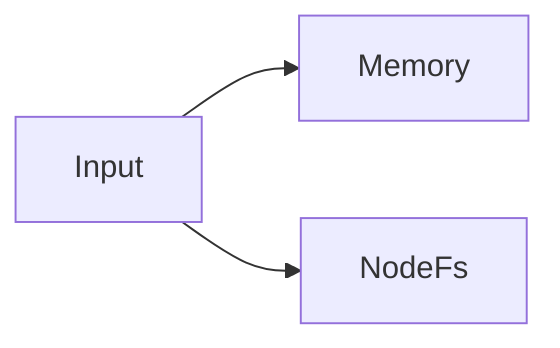
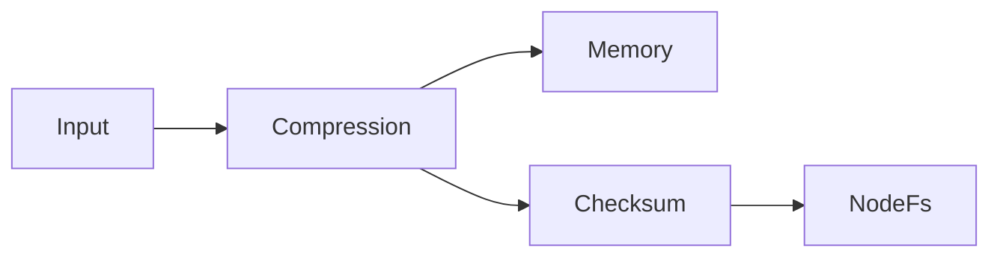
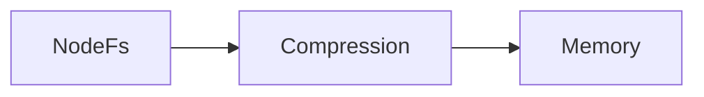

## 書き込みと読み取りの原則 [#principle]

複数登録すると、書き込みはすべてに並列で行います。読み取りは登録順に探し、見つけたストレージの前段パイプラインでデコードして返します。

```ts
const kvs = UniKvs.config<{ foo: Value<Uint8Array> }>()
  .appendStorage(new Memory())
  .appendStorage(new NodeFs(".tmp"))
  .create();
```

上記の例では、`set` はメモリーとファイルの両方に保存し、`get` はメモリーを優先します。



## パイプラインの分岐 [#branching]

各ストレージは、登録時点までのトランスフォーマーを前段に使います。交互に追加すると、ストレージごとに異なる変換を適用できます。

```ts
const kvs = UniKvs.config<{ foo: Value<Uint8Array> }>()
  .appendTransformer(new Compression("gzip"))
  .appendStorage(new Memory()) // 圧縮のみ
  .appendTransformer(new ChecksumSha256())
  .appendStorage(new NodeFs(".tmp")) // 圧縮 + チェックサム
  .create();
```



<CodeGroup>

```ts キャッシュと永続化の併用
const kvs = UniKvs.config<{ foo: Value<Uint8Array> }>()
  .appendStorage(new Memory())
  .appendStorage(new NodeFs(".tmp"))
  .create();
```

```ts 環境別の切り替え
const storages = process.env.NODE_ENV === "production"
  ? [new NodeFs(".data")]
  : [new Memory()];

const kvs = UniKvs.config<{ foo: Value<Uint8Array> }>()
  .appendStorage(storages[0])
  .create();
```

</CodeGroup>

- 高速なキャッシュと永続化用の本命を併用します。
- 開発時はメモリーのみ、本番ではファイルや S3 を追加します。
- 監査用にもう 1 つ追加し、復旧経路を確保します。
- `@unikvs/writeonly` でラップし、改変できないアーカイブを残します。

## 読み取り時の書き戻し [#read-repair]

`get` と `stream` は `repair: true` を渡すと、後段のストレージで見つかったデータを、デコードしながら前段へ書き戻して返します。各ストレージの保存形式は登録時点のトランスフォーマー数で決まるため、デコード途中の値がそのまま書き戻し先の形式になります。エンコードし直す必要はありません。

```ts
const kvs = UniKvs.config<{ foo: Value<Uint8Array> }>()
  .appendStorage(new Memory()) // 圧縮前
  .appendTransformer(new Compression("gzip"))
  .appendStorage(new NodeFs(".tmp")) // 圧縮後
  .create();

// NodeFs にしかない値は、復元しながら Memory にも書き戻されます。
const bytes = await kvs.get("foo", { repair: true });
```



- 書き戻すのは、存在確認で見つからなかったストレージだけです。存在確認自体に失敗したストレージには書き戻しません。
- 書き戻しはベストエフォートです。失敗しても読み取りは成功し、ログに残るだけです。
- 書き戻しの書き込みには、実行時変数に `unikvs:repair: true` が付与されます。通常の書き込みと区別したい場合に使えます。
- 読み取りから書き戻しまでは、同じキーへの書き込みと直列化されます。`stream` の場合は、読み切るか破棄するまで書き込みロックを保持します。
- 既定は無効です。書き込み増幅を避けたい場合は指定しないでください。

## 設計の注意 [#notes]

:::warning
`clear`・`delete` はすべてのストレージに適用します。削除範囲を分けるならクライアントを分けてください。
:::

- 読み取り優先度は登録順です。高速な保存先を先に登録してください。
- 圧縮とチェックサムを併用する場合は、検証対象が圧縮前か圧縮後かを意識して順序を決めてください。
- 部分的な書き込み失敗は集約エラーになります。詳細はエラーと診断を参照してください。
- `@unikvs/writeonly` でラップしたストレージは、既定で削除操作を無視します。削除対象から除外したい保存先に使えます。
