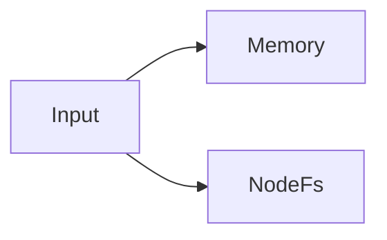
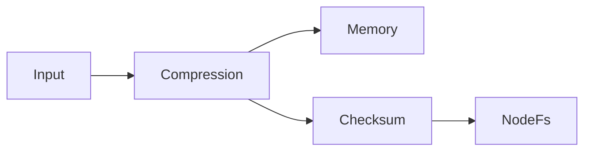

## 書き込みと読み取りの原則 [#principle]

複数のストレージを登録すると、書き込みはすべてのストレージに並列で行われます。読み取りは登録順に探索し、キーが見つかったストレージの前段パイプラインでデコードして返します。

```ts
const kvs = UniKvs.config<{ foo: Value<Uint8Array> }>()
  .appendStorage(new Memory())
  .appendStorage(new NodeFs(".tmp"))
  .create();
```

上記の例では、`set` はメモリーとファイルの両方に保存し、`get` はメモリーを優先して取得します。



## パイプラインの分岐 [#branching]

各ストレージは、登録時点までのトランスフォーマーを前段に使います。交互に追加すると、ストレージごとに異なる変換を適用できます。

```ts
const kvs = UniKvs.config<{ foo: Value<Uint8Array> }>()
  .appendTransformer(new Compression("gzip"))
  .appendStorage(new Memory())
  .appendTransformer(new ChecksumSha256())
  .appendStorage(new NodeFs(".tmp"))
  .create();
```



- メモリー側は圧縮のみ適用されます。
- ファイル側は圧縮とチェックサム検証が適用されます。

用途別の使い分け例は次のとおりです。

<CodeGroup>

```ts キャッシュと永続化の併用
const kvs = UniKvs.config<{ foo: Value<Uint8Array> }>()
  .appendStorage(new Memory())
  .appendStorage(new NodeFs(".tmp"))
  .create();
```

```ts 環境別の切り替え
const storages = process.env.NODE_ENV === "production"
  ? [new NodeFs(".data")]
  : [new Memory()];

const kvs = UniKvs.config<{ foo: Value<Uint8Array> }>()
  .appendStorage(storages[0])
  .create();
```

</CodeGroup>

- 高速な読み取り用キャッシュと、永続化用の本命保存先を併用します。
- 開発時はメモリーのみ、本番ではファイルやS3を追加します。
- 監査用にもう1つの保存先を追加し、障害時の復旧経路を確保します。

## 設計の注意 [#notes]

:::warning
`clear` と `delete` は登録されたすべてのストレージに適用されます。本命とキャッシュで削除範囲を分けたい場合は、クライアントを分けてください。
:::

- 読み取り優先度は登録順で決まります。高速な保存先を先に登録してください。
- トランスフォーマーの順序は保存形式に影響します。圧縮とチェックサムを併用する場合は、検証対象を圧縮前と圧縮後のどちらにするかを意識して順序を決めてください。
- 部分的な書き込み失敗は集約エラーとして報告されます。詳細はエラーと診断のページを参照してください。
