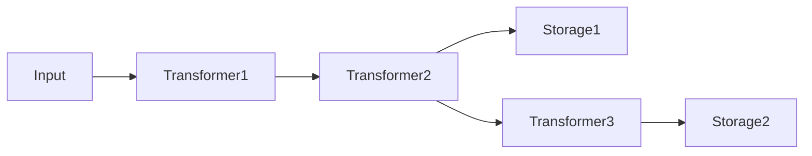

## 概要 [#overview]

`unikvs` はメインクライアントのパッケージです。<Badge>メインクライアント</Badge> 設定ビルダー (`UniKvs.config()` / `UniKvsConfig`) でトランスフォーマーとストレージを組み立て、生成したクライアント (`UniKvs`) で読み書きします。

```package-install
npm i unikvs
```

## 設定ビルダー [#config-builder]

`UniKvs.config<T>()` でビルダーを作ります。`T` はキーから値へのマッピング (`{ [key]: PlainValue | StreamValue | Value }`) で、キーごとに使える操作が型レベルで決まります。

```ts
import { UniKvs, type Value } from "unikvs";

const kvs = UniKvs.config<{
  foo: Value<Uint8Array>;
}>()
  .appendStorage(storage)
  .create();
```

設定は以下の順序で行います。

<Steps>
  <Step title="`setVariables(vars)`">
    実行時変数の初期値を設定します (任意)。呼ぶたびに置換します。
  </Step>
  <Step title="`appendTransformer(transformer)`">
    トランスフォーマーを追加します (任意)。ストレージ登録後にも追加できます。
  </Step>
  <Step title="`appendStorage(storage)`">
    ストレージを追加します (必須、複数可)。
  </Step>
  <Step title="`create()`">
    `UniKvs` クライアントを作ります。ストレージがなければ `MissingStorageError` を投げます。
  </Step>
</Steps>

:::warning[ストレージ未登録に注意]
`create()` の前に `appendStorage()` を少なくとも 1 回呼んでください。
:::

各ストレージは、登録時点までのトランスフォーマーを前段パイプラインとして使います。交互に追加すると、ストレージごとに異なるパイプラインになります。

```ts
const kvs = UniKvs.config<{ foo: Value<Uint8Array> }>()
  .appendTransformer(transformer1)
  .appendTransformer(transformer2)
  .appendStorage(storage1)
  .appendTransformer(transformer3)
  .appendStorage(storage2)
  .create();
```

上記の設定は、次のパイプラインになります。



:::note[パイプライン分岐に注意]
交互に追加すると、ストレージごとに異なる前段パイプラインになります。どのストレージがどのトランスフォーマーを経由するか、図で確認してください。
:::

書き込みはすべてのストレージに並列で行い、読み取りは見つかったストレージの前段パイプラインを逆順に適用してデコードします。

## クライアント操作 [#client-operations]

作成したクライアントは次の操作を提供します。`open()` で初期化し、使い終わったら `close()` で閉じます (`await using` でも自動クローズできます)。

| メソッド          | 説明                                                     |
| ----------------- | -------------------------------------------------------- |
| `open()`          | ストレージとトランスフォーマーを初期化します。           |
| `close()`         | すべてのストレージとトランスフォーマーをクローズします。 |
| `set(key, value)` | キーに値を保存します。                                   |
| `get(key)`        | キーから値を取得します。                                 |
| `stream(key)`     | キーからストリームを取得します。                         |
| `has(key)`        | キーが存在するかを確認します。                           |
| `delete(key)`     | キーを削除します。                                       |
| `clear()`         | すべてのデータを削除します。                             |

すべての操作は `AbortSignal` によるキャンセルと、実行時変数 (`vars`) の受け渡しに対応します。引数はオプションオブジェクト形式と位置引数形式のどちらでも指定できます。

```ts
const ac = new AbortController();
setTimeout(() => ac.abort(), 1000);

await kvs.set("foo", new Uint8Array([0, 1, 2]), {
  signal: ac.signal,
  vars: { traceId: "abc-123" },
});

const bytes = await kvs.get("foo", { signal: ac.signal });
```

## 値の型 [#value-types]

`PlainValue<T>`・`StreamValue<T>`・`Value<T>` は型レベルの目印で、キーごとに使えるメソッドを制限します。

| 型              | 書き込み                           | 読み取り      | ストリーム読み取り            |
| --------------- | ---------------------------------- | ------------- | ----------------------------- |
| `PlainValue<T>` | `set(key, T)`                      | `get(key): T` | 不可。                          |
| `StreamValue<T>` | `set(key, T \| ReadableStream<T>)` | 不可。          | `stream(key): ValueStream<T>` |
| `Value<T>`      | `set(key, T \| ReadableStream<T>)` | `get(key): T` | `stream(key): ValueStream<T>` |

```ts
import { UniKvs, type PlainValue, type StreamValue } from "unikvs";

const kvs = UniKvs.config<{
  message: PlainValue<string>;
  logs: StreamValue<Uint8Array>;
}>()
  .appendStorage(storage)
  .create();

await kvs.open();

await kvs.set("message", "hello");
const msg = await kvs.get("message");
// msg は string 型になります

await kvs.set("logs", new Uint8Array([0x01]));
const valueStream = await kvs.stream("logs");
```

許可されていない組み合わせは型エラーです。

```ts
// 型エラー: PlainValue のキーに stream() は使えません
kvs.stream("message");

// 型エラー: StreamValue のキーに get() は使えません
kvs.get("logs");
```

## ValueStream [#value-stream]

`stream()` の戻り値は `ValueStream<T>` で、<Badge variant="success">ストリーム対応</Badge> `ReadableStream` のラッパーです。標準操作に加えて非同期イテレーター (`for await...of`) と非同期破棄 (`await using`・`dispose()`) に対応します。使い終わったら破棄して読み取りロックを解放します。

<Tabs>
  <Tab title="getReader">

```ts
const reader = (await kvs.stream("logs")).getReader();
while (true) {
  const { done, value } = await reader.read();
  if (done) {
    break;
  }
  console.log(value); // Uint8Array
}
```

  </Tab>
  <Tab title="for-await">

```ts
for await (const chunk of await kvs.stream("logs")) {
  console.log(chunk); // Uint8Array
}
```

  </Tab>
  <Tab title="await using">

```ts
await using (const valueStream = await kvs.stream("logs")) {
  const reader = valueStream.getReader();
  const { value } = await reader.read();
  console.log(value);
}
```

  </Tab>
</Tabs>

:::warning[使い終わったストリームは破棄してください]
`await using` による自動破棄か `dispose()` を忘れないでください。
:::

## 変数とキャンセル [#variables-and-cancellation]

`vars` はオブジェクト形式とエントリー配列形式 (`readonly [key, value][]`) のどちらでも指定できます。操作ごとの `vars` は、ビルダーの `setVariables()` を上書きする形で結合します。`unikvs:action` と `unikvs:key` は操作の種類と対象キーとして自動付与します。

```ts
const kvs = UniKvs.config<{ foo: Value<Uint8Array> }>()
  .setVariables({ region: "ap-northeast-1" })
  .appendStorage(storage)
  .create();

await kvs.open();

// 操作ごとの vars が同じキーを上書きします
await kvs.set("foo", new Uint8Array([1]), {
  vars: { region: "us-east-1" },
});

// 配列形式でも指定できます
await kvs.get("foo", {
  vars: [["region", "us-east-1"]],
});
```

キャンセルは `AbortSignal` で行い、中断した操作は理由とともに失敗します。

```ts
const ac = new AbortController();
setTimeout(() => ac.abort(), 1000);

await kvs.set("foo", new Uint8Array([1]), { signal: ac.signal });
```

## エラー [#errors]

| エラークラス | 説明 |
| --------------------------------- | -------------------------------------------------------------------- |
| `KeyNotFoundError` | キーがどのストレージにもありません。 |
| `UniKvsIsNotOpenError` | 未オープンで操作しました。 |
| `UniKvsIsOpenError` | オープン済みで再度 `open()` しました。 |
| `MissingStorageError` | ストレージ未登録で `create()` しました。 |
| `StorageIsNotOpenError` | ストレージが未オープンです。 |
| `TransformerIsNotOpenError` | トランスフォーマーが未オープンです。 |
| `PluginOperationAggregateError` | 複数プラグイン操作の集約エラーです。 |
| `InvalidInputError` | 入力形式が不正です。 |
| `InvalidOutputError` | 出力形式が不正です。 |
| `ReadableStreamNotSupportedError` | 読み取りストリーム未対応です。 |
| `WritableStreamNotSupportedError` | 書き込みストリーム未対応です。 |
| `EncodableStreamNotSupportedError` | エンコード用ストリーム未対応です。 |
| `DecodableStreamNotSupportedError` | デコード用ストリーム未対応です。 |

```ts
import { KeyNotFoundError } from "unikvs";

try {
  const bytes = await kvs.get("missing-key");
} catch (ex) {
  if (ex instanceof KeyNotFoundError) {
    console.log("キーが見つかりません");
  } else {
    throw ex;
  }
}
```

エラーの分類や対処は横断ドキュメントに譲ります。

## 使用例 [#examples]

`@unikvs/memory` を使った最小例です。

```ts
import { Memory } from "@unikvs/memory";
import { UniKvs, type Value } from "unikvs";

const kvs = UniKvs.config<{
  foo: Value<Uint8Array>;
}>()
  .appendStorage(new Memory())
  .create();

await kvs.open();

await kvs.set("foo", new Uint8Array([0, 1, 2]));

const bytes = await kvs.get("foo");
console.log(bytes); // Uint8Array(3) [0, 1, 2]

console.log(await kvs.has("foo")); // true

await kvs.delete("foo");
await kvs.close();
```
