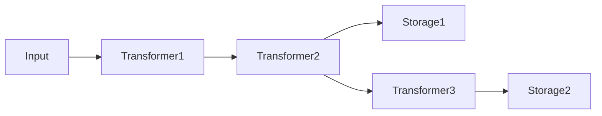

## 概要 [#overview]

パッケージ名 `unikvs` は、このリポジトリのメインクライアントを提供します。<Badge>メインクライアント</Badge> 設定ビルダー (`UniKvs.config()` / `UniKvsConfig`) でトランスフォーマーとストレージを組み立て、生成されたクライアント (`UniKvs`) で読み書きを行います。

インストールは以下のコマンドで行います。

```package-install
npm i unikvs
```

## 設定ビルダー [#config-builder]

`UniKvs.config<T>()` でビルダーを作成します。型パラメーター `T` はキーから値へのマッピング (`{ [key]: PlainValue | StreamValue | Value }`) であり、キーごとに利用できる操作が型レベルで制御されます。

```ts
import { UniKvs, type Value } from "unikvs";

const kvs = UniKvs.config<{
  foo: Value<Uint8Array>;
}>()
  .appendStorage(storage)
  .create();
```

設定は以下の順序で行います。

<Steps>
  <Step title="`setVariables(vars)`">
    実行時変数の初期値を設定します (省略可能です)。呼び出すたびに既存の値は置換されます。
  </Step>
  <Step title="`appendTransformer(transformer)`">
    トランスフォーマーを追加します (省略可能です)。ストレージの登録後にも追加できます。
  </Step>
  <Step title="`appendStorage(storage)`">
    ストレージを追加します (必須であり、複数追加できます)。
  </Step>
  <Step title="`create()`">
    `UniKvs` クライアントを作成します。ストレージが 1 つも登録されていない場合は `MissingStorageError` が投げられます。
  </Step>
</Steps>

:::warning[ストレージ未登録にご注意]
ストレージが 1 つも登録されていない状態で `create()` を呼び出すと `MissingStorageError` が投げられます。`create()` の前に `appendStorage()` を少なくとも 1 回呼び出してください。
:::

各ストレージは、登録時点までに追加されたトランスフォーマーを専用の前段パイプラインとして使います。そのため、トランスフォーマーとストレージを交互に追加すると、ストレージごとに異なるパイプラインが構成されます。

```ts
const kvs = UniKvs.config<{ foo: Value<Uint8Array> }>()
  .appendTransformer(transformer1)
  .appendTransformer(transformer2)
  .appendStorage(storage1)
  .appendTransformer(transformer3)
  .appendStorage(storage2)
  .create();
```

上記の設定は、以下のパイプラインになります。



:::note[パイプライン分岐にご注意]
上記のようにトランスフォーマーとストレージを交互に追加すると、ストレージごとに異なる前段パイプラインが構成されます。どのストレージがどのトランスフォーマーを経由するか、図で確認してから設定してください。
:::

書き込み時はすべてのストレージに並列で書き込まれます。読み取り時は、キーが見つかったストレージの前段パイプラインを逆順に適用してデコードします。

## クライアント操作 [#client-operations]

作成したクライアントは以下の操作を提供します。`open()` で初期化し、使い終わったら `close()` でクローズします (`await using` による自動クローズも利用できます)。

| メソッド          | 説明                                                     |
| ----------------- | -------------------------------------------------------- |
| `open()`          | ストレージとトランスフォーマーを初期化します。           |
| `close()`         | すべてのストレージとトランスフォーマーをクローズします。 |
| `set(key, value)` | キーに値を保存します。                                   |
| `get(key)`        | キーから値を取得します。                                 |
| `stream(key)`     | キーからストリームを取得します。                         |
| `has(key)`        | キーが存在するかを確認します。                           |
| `delete(key)`     | キーを削除します。                                       |
| `clear()`         | すべてのデータを削除します。                             |

すべての操作は `AbortSignal` によるキャンセルと、実行時変数 (`vars`) の受け渡しをサポートします。引数はオプションオブジェクト形式と、キー・値を位置引数で渡す形式のどちらでも指定できます。

```ts
const ac = new AbortController();
setTimeout(() => ac.abort(), 1000);

await kvs.set("foo", new Uint8Array([0, 1, 2]), {
  signal: ac.signal,
  vars: { traceId: "abc-123" },
});

const bytes = await kvs.get("foo", { signal: ac.signal });
```

## 値の型 [#value-types]

`PlainValue<T>` / `StreamValue<T>` / `Value<T>` は型レベルの目印であり、キーごとに利用可能なメソッドを制限します。

| 型              | 書き込み                           | 読み取り      | ストリーム読み取り            |
| --------------- | ---------------------------------- | ------------- | ----------------------------- |
| `PlainValue<T>` | `set(key, T)`                      | `get(key): T` | 不可                          |
| `StreamValue<T>` | `set(key, T \| ReadableStream<T>)` | 不可          | `stream(key): ValueStream<T>` |
| `Value<T>`      | `set(key, T \| ReadableStream<T>)` | `get(key): T` | `stream(key): ValueStream<T>` |

```ts
import { UniKvs, type PlainValue, type StreamValue } from "unikvs";

const kvs = UniKvs.config<{
  message: PlainValue<string>;
  logs: StreamValue<Uint8Array>;
}>()
  .appendStorage(storage)
  .create();

await kvs.open();

await kvs.set("message", "hello");
const msg = await kvs.get("message");
// msg は string 型になります

await kvs.set("logs", new Uint8Array([0x01]));
const valueStream = await kvs.stream("logs");
```

許可されていない組み合わせは型エラーになります。

```ts
// 型エラーになります: PlainValue のキーには stream() を使えません
kvs.stream("message");

// 型エラーになります: StreamValue のキーには get() を使えません
kvs.get("logs");
```

## ValueStream [#value-stream]

`stream()` の戻り値は `ValueStream<T>` であり、<Badge variant="success">ストリーム対応</Badge> `ReadableStream` のラッパーです。標準的なストリーム操作に加えて、非同期イテレーター (`for await...of`) と非同期破棄 (`await using` / `dispose()`) をサポートします。使い終わったストリームを破棄すると、キーの読み取りロックが解放されます。

<Tabs>
  <Tab title="getReader">

```ts
// getReader() を使う方法
const reader = (await kvs.stream("logs")).getReader();
while (true) {
  const { done, value } = await reader.read();
  if (done) {
    break;
  }
  console.log(value); // Uint8Array
}
```

  </Tab>
  <Tab title="for-await">

```ts
// 非同期イテレーターを使う方法
for await (const chunk of await kvs.stream("logs")) {
  console.log(chunk); // Uint8Array
}
```

  </Tab>
  <Tab title="await using">

```ts
// 自動破棄を使う方法
await using (const valueStream = await kvs.stream("logs")) {
  const reader = valueStream.getReader();
  const { value } = await reader.read();
  console.log(value);
}
```

  </Tab>
</Tabs>

:::warning[使い終わったストリームは破棄してください]
`ValueStream` を使い終わったら破棄すると、キーの読み取りロックが解放されます。`await using` による自動破棄か `dispose()` の呼び出しを忘れないでください。
:::

## 変数とキャンセル [#variables-and-cancellation]

`vars` はオブジェクト形式とエントリー配列形式 (`readonly [key, value][]`) のどちらでも指定できます。操作ごとに渡した `vars` は、ビルダーの `setVariables()` で設定した値を上書きする形で結合されます。また `unikvs:action` と `unikvs:key` は操作の種類と対象キーを表す変数として自動的に付与されます。

```ts
// ビルダー側で基本となる変数を設定します
const kvs = UniKvs.config<{ foo: Value<Uint8Array> }>()
  .setVariables({ region: "ap-northeast-1" })
  .appendStorage(storage)
  .create();

await kvs.open();

// 操作ごとの vars が同じキーを上書きします
await kvs.set("foo", new Uint8Array([1]), {
  vars: { region: "us-east-1" },
});

// 配列形式でも指定できます
await kvs.get("foo", {
  vars: [["region", "us-east-1"]],
});
```

キャンセルは `AbortSignal` で行います。中断された操作は、中断理由とともに失敗します。

```ts
const ac = new AbortController();
setTimeout(() => ac.abort(), 1000);

await kvs.set("foo", new Uint8Array([1]), { signal: ac.signal });
```

## エラー [#errors]

主なエラークラスは以下のとおりです。

| エラークラス                      | 説明                                                                 |
| --------------------------------- | -------------------------------------------------------------------- |
| `KeyNotFoundError`                | 指定したキーのデータがどのストレージにも存在しない場合に投げられます。 |
| `UniKvsIsNotOpenError`            | クライアントが開かれていない状態で操作が行われた場合に投げられます。 |
| `UniKvsIsOpenError`               | すでに開いているクライアントに再度 `open()` した場合に投げられます。 |
| `MissingStorageError`             | ストレージが 1 つも登録されていない状態で `create()` した場合に投げられます。 |
| `StorageIsNotOpenError`           | ストレージが開かれていない状態で操作が行われた場合に投げられます。 |
| `TransformerIsNotOpenError`       | トランスフォーマーが開かれていない状態で操作が行われた場合に投げられます。 |
| `PluginOperationAggregateError`   | 複数のプラグイン操作が失敗した場合の集約エラーです。                 |
| `InvalidInputError`               | 入力値が期待する形式に適合しない場合に投げられます。                 |
| `InvalidOutputError`              | 出力値が期待する形式に適合しない場合に投げられます。                 |
| `ReadableStreamNotSupportedError` | ストレージが読み取りストリームをサポートしない場合に投げられます。   |
| `WritableStreamNotSupportedError` | ストレージが書き込みストリームをサポートしない場合に投げられます。   |
| `EncodableStreamNotSupportedError` | トランスフォーマーがエンコード用ストリームをサポートしない場合に投げられます。 |
| `DecodableStreamNotSupportedError` | トランスフォーマーがデコード用ストリームをサポートしない場合に投げられます。 |

```ts
import { KeyNotFoundError } from "unikvs";

try {
  const bytes = await kvs.get("missing-key");
} catch (ex) {
  if (ex instanceof KeyNotFoundError) {
    console.log("キーが見つかりません");
  } else {
    throw ex;
  }
}
```

エラーの詳細な分類や対処方法については、横断ドキュメントに譲ります。

## 使用例 [#examples]

`@unikvs/memory` を使った最小完動例です。

```ts
import { Memory } from "@unikvs/memory";
import { UniKvs, type Value } from "unikvs";

const kvs = UniKvs.config<{
  foo: Value<Uint8Array>;
}>()
  .appendStorage(new Memory())
  .create();

await kvs.open();

await kvs.set("foo", new Uint8Array([0, 1, 2]));

const bytes = await kvs.get("foo");
console.log(bytes); // Uint8Array(3) [0, 1, 2]

console.log(await kvs.has("foo")); // true

await kvs.delete("foo");
await kvs.close();
```
