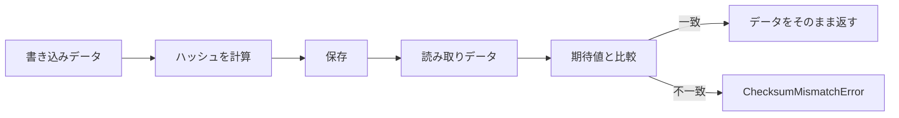

## 概要 [#overview]

`@unikvs/checksum` は、バイト配列のハッシュ値を計算し、変数に設定した期待値と照合するトランスフォーマーです。データ自体は変えず、検証に成功したら入力をそのまま返します。

対応アルゴリズムは次の 6 種類です。

| アルゴリズム | クラス | 変数キー | ハッシュ関数 |
| --- | --- | --- | --- |
| MD5 | `ChecksumMd5` | `@unikvs/checksum:md5` | `@noble/hashes/legacy.js` の `md5`。 |
| SHA-1 | `ChecksumSha1` | `@unikvs/checksum:sha1` | `@noble/hashes/legacy.js` の `sha1`。 |
| SHA-224 | `ChecksumSha224` | `@unikvs/checksum:sha224` | `@noble/hashes/sha2.js` の `sha224`。 |
| SHA-256 | `ChecksumSha256` | `@unikvs/checksum:sha256` | `@noble/hashes/sha2.js` の `sha256`。 |
| SHA-384 | `ChecksumSha384` | `@unikvs/checksum:sha384` | `@noble/hashes/sha2.js` の `sha384`。 |
| SHA-512 | `ChecksumSha512` | `@unikvs/checksum:sha512` | `@noble/hashes/sha2.js` の `sha512`。 |

インストールは次のとおりです。ハッシュ計算の実体はピア依存の `@noble/hashes` が提供します。

```package-install
npm i @unikvs/checksum @noble/hashes@2.0.0
```

`package.json` では `@noble/hashes` の `2.0.0` と `@logtape/logtape` の `2.0.0` が `peerDependencies` に指定されています。利用する環境に合わせて両方を導入してください。

## クラス一覧 [#classes]

基底クラスは抽象クラスの `Checksum` です。各サブクラスは名前・ハッシュ関数・変数キーを固定したプリセットで、`new` で直接作る想定はありません。

| クラス | コンストラクターに渡す値 |
| --- | --- |
| `Checksum` | 直接生成は想定していません。 |
| `ChecksumMd5` | `options?: ChecksumMd5Options` のみです。 |
| `ChecksumSha1` | `options?: ChecksumSha1Options` のみです。 |
| `ChecksumSha224` | `options?: ChecksumSha224Options` のみです。 |
| `ChecksumSha256` | `options?: ChecksumSha256Options` のみです。 |
| `ChecksumSha384` | `options?: ChecksumSha384Options` のみです。 |
| `ChecksumSha512` | `options?: ChecksumSha512Options` のみです。 |

たとえば `ChecksumSha256` は名前 `"ChecksumSha256"` と `sha256` 関数、変数キー `"@unikvs/checksum:sha256"` を固定しています。

オプション型は `ChecksumOptions` が基準です。各サブクラス用の型は同内容です。

```ts
type ChecksumOptions = {
  readonly required?: boolean | undefined;
};
```

`required` を省略すると `false` 扱いです。`name` にはサブクラスごとの固定名が入り、`isOpen` は常に `true` を返します。

## 使い方 [#usage]

サブクラスはオプションのみで生成できます。通常はサブクラスを使います。

```ts
import { ChecksumSha256 } from "@unikvs/checksum";

const optional = new ChecksumSha256();
const required = new ChecksumSha256({ required: true });
```

期待するハッシュ値は、実行時変数 `vars` に 16 進文字列で設定します。キーはクラスごとに決まっています。`ChecksumSha256` なら `ChecksumSha256.CHECKSUM_VAR_NAME` (`"@unikvs/checksum:sha256"`) を使います。

:::tip
キーは文字列を直書きせず、`ChecksumSha256.CHECKSUM_VAR_NAME` のように静的プロパティーから参照してください。対応誤りを防げます。
:::

```ts
const vars = {
  "@unikvs/checksum:sha256":
    "9f86d081884c7d659a2feaa0c55ad015a3bf4f1b2b0b822cd15d6c15b0f00a08",
};

const result = optional.encode({ vars, data });
```

トランスフォーマーとして組み込む場合は、ビルダーに登録します。

```ts
import { ChecksumSha256 } from "@unikvs/checksum";

const transformer = new ChecksumSha256({ required: true });

builder.appendTransformer(transformer);
```

`builder` は `UniKvs.config()` が返す設定ビルダーです。検証用の変数は実行時に `vars` で渡します。

## 検証の仕組み [#verification]

`encode`・`decode` は同じ一括検証、`getEncodable`・`getDecodable` は同じストリーム検証を行います。書き込みと読み取りで処理は変わりません。

一括検証の流れは次のとおりです。

1. `CHECKSUM_VAR_NAME` に対応する値を `vars` から取得します。
2. 文字列ならハッシュを計算して 16 進文字列で比較し、不一致なら `ChecksumMismatchError` を投げます。
3. 文字列でなければ、`required: true` なら `ChecksumRequiredError` を投げ、`false` なら計算を省略してそのまま返します。
4. 検証に成功してもデータを変えずに返します。

ストリーム検証の流れは次のとおりです。

1. `vars` から期待値を取り出します。文字列でなければ、`required: true` なら `ChecksumRequiredError` を投げ、`false` なら透過 `TransformStream` を返します。
2. 文字列なら `this.hash.create()` で `IHasher` を作ります。
3. 各チャンクを 4 GB 単位に分割しながら `hasher.update` し、下流にはそのまま流します。
4. 終了時の `flush` で `digest()` を 16 進文字列に変換して比較し、不一致なら `ChecksumMismatchError` を投げます。



## エラー [#errors]

このパッケージは次の 3 種類のエラーを投げます。

| エラー | 意味 | 対処 |
| --- | --- | --- |
| `ChecksumMismatchError` | ハッシュが期待値と一致しません。`meta` に `actual`・`expected` を含みます。 | 期待値の指定誤りかデータの破損を確認してください。 |
| `ChecksumRequiredError` | `required: true` なのに `vars` に文字列のチェックサムがありません。 | 変数キーに 16 進文字列を設定するか、`required` を `false` にしてください。 |
| `ChecksumInvalidVarNameError` | `CHECKSUM_VAR_NAME` が文字列ではありません。通常のサブクラスでは発生しません。 | 基底クラスを独自継承した場合に静的プロパティーを確認してください。 |

一括検証では `encode`・`decode` の呼び出し時に、ストリーム検証では `flush` 時に `ChecksumMismatchError` を投げます。

:::danger
不一致のときは処理を続けず、`meta` の `actual` と `expected` を比べて切り分けてください。
:::

```ts
import {
  ChecksumMismatchError,
  ChecksumRequiredError,
} from "@unikvs/checksum";

try {
  transformer.encode({ vars, data });
} catch (error) {
  if (error instanceof ChecksumMismatchError) {
    console.log(error.meta.actual);
    console.log(error.meta.expected);
  } else if (error instanceof ChecksumRequiredError) {
    console.log("チェックサムが指定されていません。");
  } else {
    throw error;
  }
}
```

## サブパスエクスポート [#exports]

`package.json` の `exports` のサブパスを使い分けられます。

| サブパス | 内容 |
| --- | --- |
| `.` | 全クラスと全エラーを再出力します。 |
| `./checksum` | 基底クラスの `Checksum` と関連する型を出力します。 |
| `./errors` | `ChecksumMismatchError` と `ChecksumRequiredError` と `ChecksumInvalidVarNameError` を出力します。 |
| `./md5` | `ChecksumMd5` を出力します。 |
| `./sha1` | `ChecksumSha1` を出力します。 |
| `./sha224` | `ChecksumSha224` を出力します。 |
| `./sha256` | `ChecksumSha256` を出力します。 |
| `./sha384` | `ChecksumSha384` を出力します。 |
| `./sha512` | `ChecksumSha512` を出力します。 |

<CodeGroup>

```ts 基底クラス
import Checksum from "@unikvs/checksum/checksum";
```

```ts MD5
import ChecksumMd5 from "@unikvs/checksum/md5";
```

```ts SHA-1
import ChecksumSha1 from "@unikvs/checksum/sha1";
```

```ts SHA-224
import ChecksumSha224 from "@unikvs/checksum/sha224";
```

```ts SHA-256
import ChecksumSha256 from "@unikvs/checksum/sha256";
```

```ts SHA-384
import ChecksumSha384 from "@unikvs/checksum/sha384";
```

```ts SHA-512
import ChecksumSha512 from "@unikvs/checksum/sha512";
```

```ts エラー
import {
  ChecksumMismatchError,
  ChecksumRequiredError,
  ChecksumInvalidVarNameError,
} from "@unikvs/checksum/errors";
```

</CodeGroup>

既定ではルートから指定します。

```ts
import { ChecksumSha256 } from "@unikvs/checksum";
```

## 使用例 [#examples]

`ChecksumSha256` で一括検証する最小例です。文字列 `"test"` の SHA-256 ハッシュ値を使います。

```ts
import { ChecksumSha256, ChecksumMismatchError } from "@unikvs/checksum";

const transformer = new ChecksumSha256();
const data = new TextEncoder().encode("test");
const vars = {
  [ChecksumSha256.CHECKSUM_VAR_NAME]:
    "9f86d081884c7d659a2feaa0c55ad015a3bf4f1b2b0b822cd15d6c15b0f00a08",
};

const verified = transformer.encode({ vars, data });
console.log(verified);

try {
  transformer.encode({
    vars: { [ChecksumSha256.CHECKSUM_VAR_NAME]: "0".repeat(64) },
    data,
  });
} catch (error) {
  if (error instanceof ChecksumMismatchError) {
    console.log(`expected: ${error.meta.expected}`);
    console.log(`actual: ${error.meta.actual}`);
  } else {
    throw error;
  }
}
```
