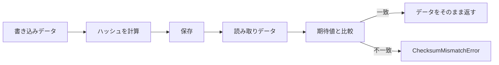

## 概要 [#overview]

`@unikvs/checksum` は、バイト配列のハッシュ値を計算し、変数に設定された期待値と照合するトランスフォーマーを提供します。データ自体は変更せず、検証に成功した場合は入力データをそのまま返します。

対応するアルゴリズムは次の 6 種類です。

| アルゴリズム | クラス | 変数キー |
| --- | --- | --- |
| MD5 | `ChecksumMd5` | `@unikvs/checksum:md5` |
| SHA-1 | `ChecksumSha1` | `@unikvs/checksum:sha1` |
| SHA-224 | `ChecksumSha224` | `@unikvs/checksum:sha224` |
| SHA-256 | `ChecksumSha256` | `@unikvs/checksum:sha256` |
| SHA-384 | `ChecksumSha384` | `@unikvs/checksum:sha384` |
| SHA-512 | `ChecksumSha512` | `@unikvs/checksum:sha512` |

インストールは次のとおりです。ハッシュ計算の実体はピア依存の `@noble/hashes` が提供します。

```package-install
npm i @unikvs/checksum @noble/hashes@2.0.0
```

`package.json` では `@noble/hashes` の `2.0.0` と `@logtape/logtape` の `2.0.0` が `peerDependencies` に指定されています。利用する環境に合わせて両方を導入してください。

## クラス一覧 [#classes]

基底クラスは抽象クラスの `Checksum` です。各アルゴリズム用のサブクラスは、名前とハッシュ関数と変数キーを固定したプリセットです。

| クラス | 役割 | コンストラクターに渡す値 |
| --- | --- | --- |
| `Checksum` | 抽象基底クラスです。`name` と `hash` と `options` を受け取ります。 | `new` による直接生成は想定されていません。 |
| `ChecksumMd5` | MD5 用のプリセットです。 | `options?: ChecksumMd5Options` のみです。 |
| `ChecksumSha1` | SHA-1 用のプリセットです。 | `options?: ChecksumSha1Options` のみです。 |
| `ChecksumSha224` | SHA-224 用のプリセットです。 | `options?: ChecksumSha224Options` のみです。 |
| `ChecksumSha256` | SHA-256 用のプリセットです。 | `options?: ChecksumSha256Options` のみです。 |
| `ChecksumSha384` | SHA-384 用のプリセットです。 | `options?: ChecksumSha384Options` のみです。 |
| `ChecksumSha512` | SHA-512 用のプリセットです。 | `options?: ChecksumSha512Options` のみです。 |

各サブクラスの実装は、`super` に固定値を渡すだけです。たとえば `ChecksumSha256` は `"ChecksumSha256"` という名前と `sha256` 関数を使い、`CHECKSUM_VAR_NAME` として `"@unikvs/checksum:sha256"` を定義します。`ChecksumMd5` と `ChecksumSha1` は `@noble/hashes/legacy.js` の `md5` と `sha1` を使い、`ChecksumSha224` と `ChecksumSha256` と `ChecksumSha384` と `ChecksumSha512` は `@noble/hashes/sha2.js` の各関数を使います。

オプション型は `ChecksumOptions` が基準です。各サブクラス用の `ChecksumMd5Options` などは `ChecksumOptions` と同じ内容です。

```ts
type ChecksumOptions = {
  readonly required?: boolean | undefined;
};
```

`required` を省略した場合は `false` として扱われます。`name` プロパティーにはサブクラスごとの固定名が入ります。`isOpen` は常に `true` を返します。

<Accordion>
  <AccordionItem title="Checksum">
    抽象基底クラスです。`name` と `hash` と `options` を受け取ります。`new` による直接生成は想定されていません。
  </AccordionItem>
  <AccordionItem title="ChecksumMd5">
    MD5 用のプリセットです。コンストラクターには `options?: ChecksumMd5Options` のみを渡します。変数キーは `@unikvs/checksum:md5` です。ハッシュ関数には `@noble/hashes/legacy.js` の `md5` を使います。
  </AccordionItem>
  <AccordionItem title="ChecksumSha1">
    SHA-1 用のプリセットです。コンストラクターには `options?: ChecksumSha1Options` のみを渡します。変数キーは `@unikvs/checksum:sha1` です。ハッシュ関数には `@noble/hashes/legacy.js` の `sha1` を使います。
  </AccordionItem>
  <AccordionItem title="ChecksumSha224">
    SHA-224 用のプリセットです。コンストラクターには `options?: ChecksumSha224Options` のみを渡します。変数キーは `@unikvs/checksum:sha224` です。ハッシュ関数には `@noble/hashes/sha2.js` の `sha224` を使います。
  </AccordionItem>
  <AccordionItem title="ChecksumSha256">
    SHA-256 用のプリセットです。コンストラクターには `options?: ChecksumSha256Options` のみを渡します。変数キーは `@unikvs/checksum:sha256` です。ハッシュ関数には `@noble/hashes/sha2.js` の `sha256` を使います。
  </AccordionItem>
  <AccordionItem title="ChecksumSha384">
    SHA-384 用のプリセットです。コンストラクターには `options?: ChecksumSha384Options` のみを渡します。変数キーは `@unikvs/checksum:sha384` です。ハッシュ関数には `@noble/hashes/sha2.js` の `sha384` を使います。
  </AccordionItem>
  <AccordionItem title="ChecksumSha512">
    SHA-512 用のプリセットです。コンストラクターには `options?: ChecksumSha512Options` のみを渡します。変数キーは `@unikvs/checksum:sha512` です。ハッシュ関数には `@noble/hashes/sha2.js` の `sha512` を使います。
  </AccordionItem>
</Accordion>

## 使い方 [#usage]

サブクラスはオプションのみで生成できます。基底クラスの `Checksum` は `name` と `IHash` 準拠のハッシュ関数を要求するため、通常はサブクラスを使います。

```ts
import { ChecksumSha256 } from "@unikvs/checksum";

const optional = new ChecksumSha256();
const required = new ChecksumSha256({ required: true });
```

期待するハッシュ値は、実行時変数 `vars` の各キーに 16 進文字列として設定します。キーはクラスごとに決まっています。`ChecksumSha256` の場合は `ChecksumSha256.CHECKSUM_VAR_NAME` すなわち `"@unikvs/checksum:sha256"` を使います。

:::tip
期待値を指定する際は、キー文字列を直接書くのではなく、`ChecksumSha256.CHECKSUM_VAR_NAME` のように静的プロパティーから参照してください。クラスと変数キーの対応誤りを防げます。
:::

```ts
const vars = {
  "@unikvs/checksum:sha256":
    "9f86d081884c7d659a2feaa0c55ad015a3bf4f1b2b0b822cd15d6c15b0f00a08",
};

const result = optional.encode({ vars, data });
```

トランスフォーマーとして組み込む場合は、`ITransformer` としてビルダーに登録します。

```ts
import { ChecksumSha256 } from "@unikvs/checksum";

const transformer = new ChecksumSha256({ required: true });

builder.appendTransformer(transformer);
```

上記の `builder` は `UniKvs.config()` が返す設定ビルダーを指します。ストレージの登録方法などはビルダーの仕様に従ってください。検証に使う変数は実行時に `vars` として渡します。

## 検証の仕組み [#verification]

`encode` と `decode` はどちらも同じ一括検証を行います。`getEncodable` と `getDecodable` はどちらも同じストリーム検証を行います。書き込みと読み取りで処理を区別しません。

一括検証の流れは次のとおりです。

1. サブクラスが定義した `CHECKSUM_VAR_NAME` に対応する値を `vars` から取得します。
2. 値が文字列の場合は `this.hash(data)` を計算し、`bytesToHex` で 16 進文字列に変換して比較します。一致しなければ `ChecksumMismatchError` を投げます。
3. 値が文字列でない場合、`required` が `true` であれば `ChecksumRequiredError` を投げます。`required` が `false` であればハッシュ計算を省略し、データをそのまま返します。
4. 検証に成功した場合も、データをそのまま返します。

ストリーム検証の流れは次のとおりです。

1. `vars` から期待値を取り出します。値が文字列でない場合、`required` が `true` であれば `ChecksumRequiredError` を投げます。`required` が `false` であれば、ハッシュ関数を使わない透過 `TransformStream` を返します。
2. 値が文字列の場合は `this.hash.create()` で `IHasher` を作成します。
3. 各チャンクが到達するたびに、`MAX_CHUNK_SIZE` である 4 GB 単位に分割しながら `hasher.update` を呼び、下流には分割後のチャンクをそのまま流します。
4. ストリーム終了時の `flush` で `hasher.digest()` を 16 進文字列に変換し、期待値と比較します。一致しなければ `ChecksumMismatchError` を投げます。



## エラー [#errors]

このパッケージは次の 3 種類のエラーを投げます。

| エラー | 意味 | 対処 |
| --- | --- | --- |
| `ChecksumMismatchError` | 計算したハッシュ値が期待値と一致しません。`meta` に `actual` と `expected` を含みます。 | 期待値の指定誤りか、データの破損を確認してください。 |
| `ChecksumRequiredError` | `required` が `true` であるにもかかわらず、`vars` に文字列のチェックサムがありません。 | 対応する変数キーに 16 進文字列を設定するか、`required` を `false` にしてください。 |
| `ChecksumInvalidVarNameError` | `CHECKSUM_VAR_NAME` が文字列ではありません。`meta` に `actual` を含みます。 | 基底クラスを独自に継承した場合に、静的プロパティーの定義を確認してください。通常のサブクラスでは発生しません。 |

`ChecksumMismatchError` は一括検証では `encode` と `decode` の呼び出し時に投げられます。ストリーム検証では終了処理の `flush` 時に投げられます。

:::danger
`ChecksumMismatchError` が投げられた場合は、そのまま処理を続けず、期待値の指定誤りかデータの破損を確認してください。`meta` の `actual` と `expected` を比べると原因の切り分けに役立ちます。
:::

```ts
import {
  ChecksumMismatchError,
  ChecksumRequiredError,
} from "@unikvs/checksum";

try {
  transformer.encode({ vars, data });
} catch (error) {
  if (error instanceof ChecksumMismatchError) {
    console.log(error.meta.actual);
    console.log(error.meta.expected);
  } else if (error instanceof ChecksumRequiredError) {
    console.log("チェックサムが指定されていません。");
  } else {
    throw error;
  }
}
```

## サブパスエクスポート [#exports]

`package.json` の `exports` には次のサブパスが定義されています。用途に応じて個別に導入できます。

| サブパス | 内容 |
| --- | --- |
| `.` | 全クラスと全エラーを再出力します。 |
| `./checksum` | 基底クラスの `Checksum` と関連する型を出力します。 |
| `./errors` | `ChecksumMismatchError` と `ChecksumRequiredError` と `ChecksumInvalidVarNameError` を出力します。 |
| `./md5` | `ChecksumMd5` を出力します。 |
| `./sha1` | `ChecksumSha1` を出力します。 |
| `./sha224` | `ChecksumSha224` を出力します。 |
| `./sha256` | `ChecksumSha256` を出力します。 |
| `./sha384` | `ChecksumSha384` を出力します。 |
| `./sha512` | `ChecksumSha512` を出力します。 |

<CodeGroup>

```ts 基底クラス
import Checksum from "@unikvs/checksum/checksum";
```

```ts MD5
import ChecksumMd5 from "@unikvs/checksum/md5";
```

```ts SHA-1
import ChecksumSha1 from "@unikvs/checksum/sha1";
```

```ts SHA-224
import ChecksumSha224 from "@unikvs/checksum/sha224";
```

```ts SHA-256
import ChecksumSha256 from "@unikvs/checksum/sha256";
```

```ts SHA-384
import ChecksumSha384 from "@unikvs/checksum/sha384";
```

```ts SHA-512
import ChecksumSha512 from "@unikvs/checksum/sha512";
```

```ts エラー
import {
  ChecksumMismatchError,
  ChecksumRequiredError,
  ChecksumInvalidVarNameError,
} from "@unikvs/checksum/errors";
```

</CodeGroup>

既定の導入ではルートからの指定を使います。

```ts
import { ChecksumSha256 } from "@unikvs/checksum";
```

## 使用例 [#examples]

次の例は `ChecksumSha256` で一括検証を行う最小例です。文字列 `"test"` の SHA-256 ハッシュ値を使います。

```ts
import { ChecksumSha256, ChecksumMismatchError } from "@unikvs/checksum";

const transformer = new ChecksumSha256();
const data = new TextEncoder().encode("test");
const vars = {
  [ChecksumSha256.CHECKSUM_VAR_NAME]:
    "9f86d081884c7d659a2feaa0c55ad015a3bf4f1b2b0b822cd15d6c15b0f00a08",
};

const verified = transformer.encode({ vars, data });
console.log(verified);

try {
  transformer.encode({
    vars: { [ChecksumSha256.CHECKSUM_VAR_NAME]: "0".repeat(64) },
    data,
  });
} catch (error) {
  if (error instanceof ChecksumMismatchError) {
    console.log(`expected: ${error.meta.expected}`);
    console.log(`actual: ${error.meta.actual}`);
  } else {
    throw error;
  }
}
```
