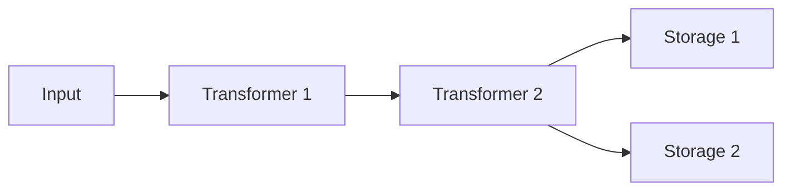

## UniKVS とは

UniKVS は、TypeScript で実装されたモジュラーでポータブルな KVS (Key-Value Store) クライアントです。

キーと値の対応を型として定義すると、キーごとに利用できる操作がコンパイル時に決まります。データの圧縮やチェックサム検証といった変換処理をトランスフォーマーとして差し込み、保存先をストレージとして指定します。アプリケーションコードはどのストレージを選んでも同じ API で動くため、テストではメモリー、本番では S3 という組み替えが可能です。

## アーキテクチャー

UniKVS はビルダーパターンで構成されます。書き込まれた値はトランスフォーマーの連鎖を通って変換され、登録されたすべてのストレージへ並列に書き込まれます。読み取り時は逆順にデコードされます。

役割は大きく 2 種類に分かれます。

- **トランスフォーマー (Transformer)**：データのエンコードとデコードを透過的に行うプラグインです。
- **ストレージ (Storage)**：データの永続化先です。複数を登録するとすべてに並列で書き込まれ、読み取りは登録順に探索されます。

詳細は [unikvs パッケージ](/ja/docs/unikvs/) を参照してください。

## パッケージ一覧

<CardGroup cols={2}>
  <Card title="unikvs" href="/ja/docs/unikvs/" icon="database">
    KVS クライアント本体。設定ビルダーと型安全な読み書き API を提供します。
  </Card>
  <Card title="@unikvs/core" href="/ja/docs/core/" icon="boxes">
    Transformer・Storage・Context のインターフェース定義。独自プラグインの開発者向けです。
  </Card>
  <Card title="@unikvs/compression" href="/ja/docs/compression/" icon="package-minus">
    gzip / deflate / deflate-raw による透過的な圧縮と展開を行うトランスフォーマーです。
  </Card>
  <Card title="@unikvs/checksum" href="/ja/docs/checksum/" icon="shield-check">
    MD5 および SHA-1 / SHA-2 ファミリーのハッシュ値を検証するトランスフォーマーです。
  </Card>
</CardGroup>

### ストレージ

<CardGroup cols={2}>
  <Card title="@unikvs/memory" href="/ja/docs/memory/" icon="memory-stick">
    メモリー上に保存します。テスト用途に適しています。
  </Card>
  <Card title="@unikvs/fs.node" href="/ja/docs/fs.node/" icon="hard-drive">
    ローカルファイルシステムに保存します。Node.js 専用です。
  </Card>
  <Card title="@unikvs/s3.node" href="/ja/docs/s3.node/" icon="cloud">
    S3 互換のオブジェクトストレージに保存します。Node.js 専用です。
  </Card>
  <Card title="@unikvs/opfs" href="/ja/docs/opfs/" icon="folder">
    ブラウザーの OPFS に保存します。
  </Card>
  <Card title="@unikvs/indexeddb" href="/ja/docs/indexeddb/" icon="archive">
    ブラウザーの IndexedDB に保存します。
  </Card>
</CardGroup>

<CardGroup cols={1}>
  <Card title="@unikvs/utils" href="/ja/docs/utils/" icon="wrench">
    プラグイン実装で共有されるユーティリティー集です。
  </Card>
</CardGroup>

## 学習の流れ

1. [unikvs パッケージの概要](/ja/docs/unikvs/) でインストールとクイックスタートを確認する。
2. [ガイド](/ja/docs/unikvs/guide) でビルダーの使い方と各操作の挙動を理解する。
3. [型システム](/ja/docs/unikvs/types) で `Value` / `PlainValue` / `StreamValue` の違いを把握する。
4. 用途に合った Storage と Transformer のドキュメントを読む。
